# Azure Data Factory Pipeline Patterns and Antipatterns

This document is an ADF-oriented companion to the generic pipeline patterns catalog.

The focus here is narrower:

- when a pattern is useful,
- how to build it in Azure Data Factory,
- which ADF activities or components to use,
- where ADF is strong,
- where ADF needs extra design discipline.

This is written for classic Azure Data Factory pipelines, not Fabric Data Factory.

## How to Read This Document

Each pattern includes:

- `What it is`
- `Typical use case`
- `How to do it in ADF`
- `Main ADF activities/components`
- a Mermaid diagram

Each antipattern includes:

- what it looks like in ADF,
- why it causes trouble,
- what to do instead.

---

# ADF Pattern Catalog

## 1. Staging / Landing Pattern

### What it is

Land source data as-is in a raw zone before any cleansing or business transformation.

### Typical use case

- ingesting files from SFTP to ADLS,
- preserving raw API payloads,
- keeping evidence for replay and debugging.

### How to do it in ADF

Build one pipeline dedicated to landing:

1. Use `Copy Data` to move source data into a raw container or folder.
2. Use `Get Metadata` before or after copy if you need file existence, size, or structure checks.
3. Use `Validation` when downstream should wait until the landed file is really present.
4. Keep landing logic separate from conformance logic by calling a second pipeline with `Execute Pipeline`.

### Main ADF activities/components

- `Copy Data`
- `Get Metadata`
- `Validation`
- `Execute Pipeline`
- parameterized datasets

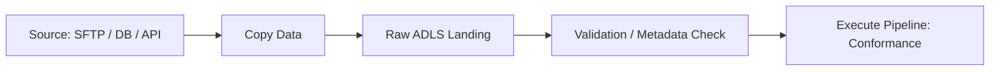

---

## 2. Split, Validate, Publish Pattern

### What it is

Separate ingestion, validation, and publication into explicit stages.

### Typical use case

- publishing trusted fact tables,
- releasing curated files only after quality checks,
- preventing half-cleaned data from reaching BI.

### How to do it in ADF

1. Pipeline A ingests into raw/staging using `Copy Data`.
2. Pipeline B validates using `Get Metadata`, `Lookup`, `If Condition`, and optionally `Data Flow`.
3. Pipeline C publishes to serving storage only when validation passes.
4. Parent orchestration uses `Execute Pipeline` with `waitOnCompletion`.

### Main ADF activities/components

- `Execute Pipeline`
- `Copy Data`
- `Get Metadata`
- `Lookup`
- `If Condition`
- `Data Flow`
- `Fail`

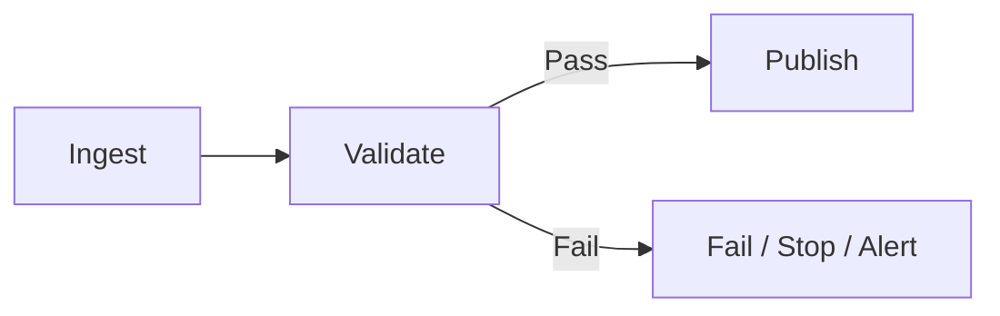

---

## 3. Idempotent Load Pattern

### What it is

Rerunning the same input does not duplicate or corrupt the target.

### Typical use case

- nightly loads that may be retried,
- backfills,
- unstable source windows.

### How to do it in ADF

ADF itself does not guarantee idempotency. You design it into the target write strategy:

1. Load into a temporary or staging target with `Copy Data` or `Data Flow`.
2. Use `Stored Procedure` for deterministic `MERGE`, replace-partition, or delete-then-insert logic.
3. Pass batch keys and watermark parameters explicitly.
4. Store run metadata externally if needed.

### Main ADF activities/components

- `Copy Data`
- `Data Flow`
- `Stored Procedure`
- pipeline parameters
- variables for run context

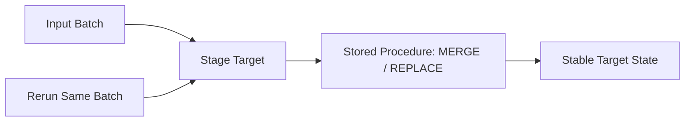

---

## 4. Full Refresh Pattern

### What it is

Rebuild the entire target on each run.

### Typical use case

- small dimensions,
- early-stage datasets,
- logic that changes often,
- sources without reliable change tracking.

### How to do it in ADF

1. Use `Copy Data` or `Data Flow` to rebuild a temp object or folder.
2. Use `Stored Procedure`, `Script`, or file replacement strategy to swap temp into final.
3. Optionally `Delete` old folder contents if file-based serving is intended.

### Main ADF activities/components

- `Copy Data`
- `Data Flow`
- `Stored Procedure` or `Script`
- `Delete`

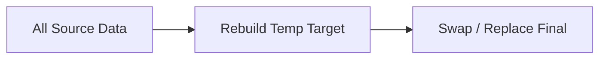

---

## 5. Incremental Load Pattern

### What it is

Only process new or changed records.

### Typical use case

- large transactional tables,
- append-heavy event feeds,
- reducing nightly load times.

### How to do it in ADF

1. Retrieve last watermark using `Lookup`.
2. Pass watermark into source query, dataset, or `Copy Data` source settings.
3. Load deltas into staging.
4. Use `Stored Procedure` or `Data Flow` to merge.
5. Persist new watermark on success.

### Main ADF activities/components

- `Lookup`
- `Copy Data`
- `Data Flow`
- `Stored Procedure`
- `Set Variable`
- `If Condition`

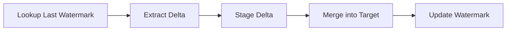

---

## 6. Metadata-Driven Fan-Out Pattern

### What it is

One reusable pipeline processes many similar tables, files, or entities based on configuration metadata.

### Typical use case

- loading 50 source tables with the same control framework,
- handling many folders with the same copy rules,
- standardizing ingestion across domains.

### How to do it in ADF

1. Store control metadata in SQL, JSON, or config files.
2. Use `Lookup` to read the control set.
3. Use `ForEach` to iterate entities.
4. Inside `ForEach`, call `Copy Data`, `Data Flow`, or `Execute Pipeline`.
5. Parameterize datasets, linked services, sink names, and queries.

### Main ADF activities/components

- `Lookup`
- `ForEach`
- `Execute Pipeline`
- `Copy Data`
- `Data Flow`
- parameterized datasets and linked services

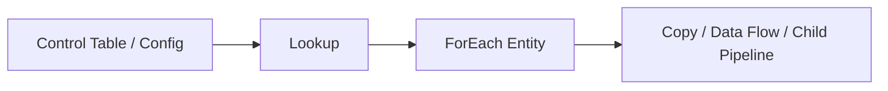

---

## 7. Contract-First Pipeline Pattern

### What it is

Design the pipeline from the expected consumer-facing dataset, not from the source shape alone.

### Typical use case

- shared reporting tables,
- datasets with strong SLA and semantic expectations,
- data products consumed by several teams.

### How to do it in ADF

ADF has no native “data contract” object, so implement the contract in the control layer:

1. Keep expected schema/rules in a control table, JSON, or SQL metadata store.
2. Use `Lookup` to fetch contract details.
3. Use `Get Metadata` for structural checks.
4. Use `If Condition` or `Data Flow` checks for business rules.
5. Block publish path with `Fail` when rules are broken.

### Main ADF activities/components

- `Lookup`
- `Get Metadata`
- `If Condition`
- `Fail`
- `Data Flow`
- control tables / config files

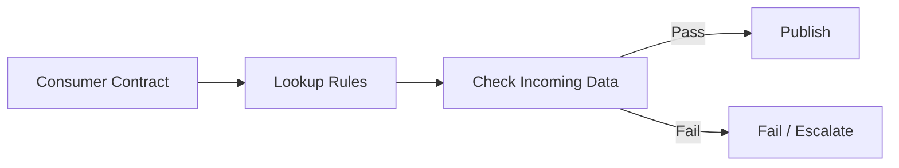

---

## 8. Schema Enforcement Pattern

### What it is

Reject or branch data when its shape no longer matches expectations.

### Typical use case

- CSV or JSON feeds that drift,
- SQL extracts where columns may change,
- upstream teams that deploy without notice.

### How to do it in ADF

1. Use `Get Metadata` to inspect structure or existence.
2. Compare metadata against expected config from `Lookup`.
3. Use `If Condition` or `Switch` to decide pass/fail path.
4. If row-level transformation is required, use `Data Flow` with column mappings and assertions.

### Main ADF activities/components

- `Get Metadata`
- `Lookup`
- `If Condition`
- `Switch`
- `Data Flow`
- `Fail`

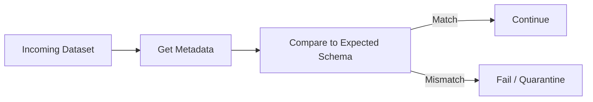

---

## 9. Semantic Checkpoint Pattern

### What it is

Check business meaning, not just shape.

### Typical use case

- status values must be from an approved list,
- revenue must not go negative unexpectedly,
- date logic must obey business time windows.

### How to do it in ADF

1. Use `Data Flow` for row-level semantic rules.
2. Use `Conditional Split`, `Filter`, `Assert`, `Derived Column`, and `Aggregate` transformations.
3. Route failing records to a reject sink.
4. Use output counts or checks to decide whether to continue.
5. If rules are aggregate-level only, `Lookup` + SQL can also work.

### Main ADF activities/components

- `Data Flow`
- `Conditional Split`
- `Assert`
- `Aggregate`
- `Lookup`
- `If Condition`

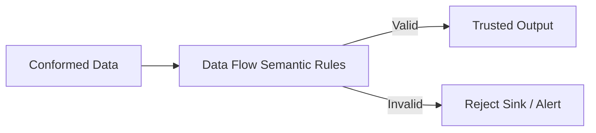

---

## 10. Quarantine Pattern

### What it is

Bad records are isolated without blocking all good records.

### Typical use case

- one file contains a few malformed rows,
- source data is noisy but still mostly usable,
- business prefers partial delivery over hard stop.

### How to do it in ADF

1. Use `Data Flow` with `Conditional Split`.
2. Route valid rows to the main sink.
3. Route invalid rows to quarantine storage.
4. Optionally write run metadata to a SQL log table with `Stored Procedure`.

### Main ADF activities/components

- `Data Flow`
- `Conditional Split`
- multiple sinks
- `Stored Procedure`

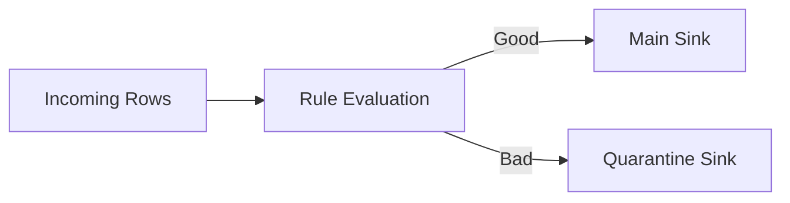

---

## 11. Reconciliation Pattern

### What it is

Compare source and target totals, counts, keys, or hashes before declaring success.

### Typical use case

- finance or compliance datasets,
- migrations,
- incremental pipelines that can drift silently.

### How to do it in ADF

1. Use `Lookup` or `Stored Procedure` to compute source aggregates.
2. Use another `Lookup` or `Stored Procedure` for target aggregates.
3. Compare values in `If Condition`.
4. Pass only when differences are within tolerance.
5. Persist the comparison outcome to audit tables.

### Main ADF activities/components

- `Lookup`
- `Stored Procedure`
- `If Condition`
- `Set Variable`
- `Fail`

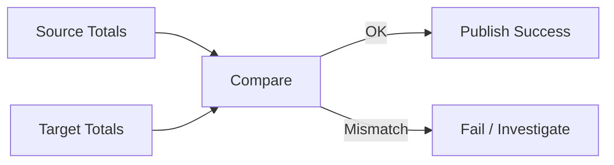

---

## 12. Execute-Pipeline Modularization Pattern

### What it is

Break one large pipeline into smaller reusable child pipelines.

### Typical use case

- separating landing, transform, validation, and publish,
- reusing the same child process across domains,
- reducing giant pipeline canvases.

### How to do it in ADF

1. Create a parent orchestration pipeline.
2. Call child pipelines with `Execute Pipeline`.
3. Pass parameters explicitly.
4. Keep child pipelines focused: one responsibility each.

### Main ADF activities/components

- `Execute Pipeline`
- pipeline parameters
- variables for orchestration

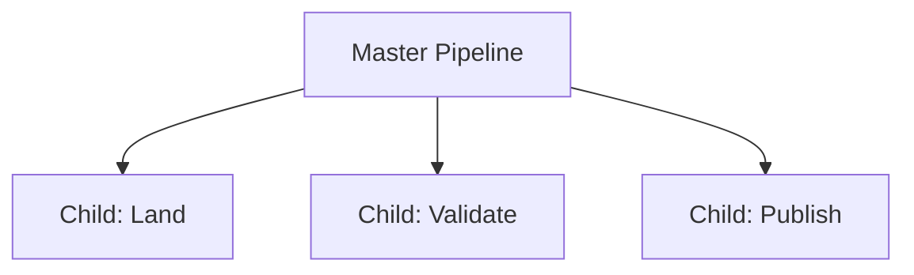

---

## 13. Wait-for-Arrival Pattern

### What it is

Pause downstream processing until a required file or dataset is ready.

### Typical use case

- partner file drops,
- external systems with uncertain delivery time,
- batch dependencies across platforms.

### How to do it in ADF

1. Use `Validation` for file existence and minimum size checks.
2. Or loop with `Until` + `Get Metadata` + `Wait`.
3. Set a clear timeout and failure path.

### Main ADF activities/components

- `Validation`
- `Until`
- `Get Metadata`
- `Wait`
- `Fail`

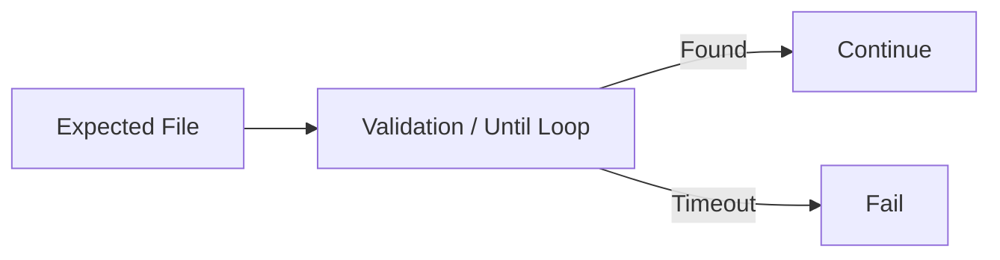

---

## 14. Error Branch / Controlled Failure Pattern

### What it is

Use explicit failure branches instead of hoping monitoring alone will explain issues.

### Typical use case

- known failure modes,
- different actions for transient and permanent errors,
- clearer operations handoff.

### How to do it in ADF

1. Use activity dependency conditions: `On Success`, `On Failure`, `On Completion`.
2. Use `If Condition`, `Web`, `Stored Procedure`, or `Fail` in failure branches.
3. Write diagnostic context into log tables.

### Main ADF activities/components

- dependency conditions
- `Fail`
- `Web`
- `Stored Procedure`
- `Set Variable`

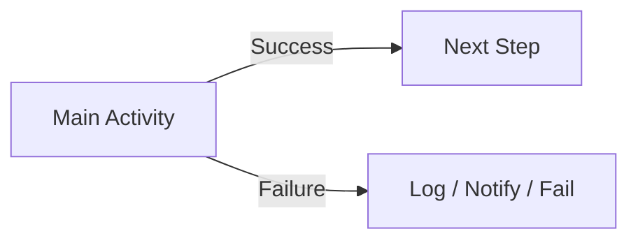

---

## 15. Data Observability Pattern

### What it is

Capture run-level trust signals: freshness, count changes, null spikes, schema drift, and semantic anomalies.

### Typical use case

- production shared pipelines,
- executive dashboards,
- feeds where silent bad data is worse than delayed data.

### How to do it in ADF

1. Compute metrics via `Lookup`, SQL, or `Data Flow`.
2. Store metrics in a monitoring table with `Stored Procedure`.
3. Compare today vs historical ranges in `If Condition`.
4. Trigger alerting with `Web` or handoff process.

### Main ADF activities/components

- `Lookup`
- `Stored Procedure`
- `If Condition`
- `Web`
- `Data Flow`

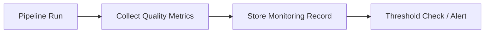

---

## 16. Metadata-Driven File Sweep Pattern

### What it is

Enumerate a folder and process each discovered file using the same logic.

### Typical use case

- daily folder ingestion,
- processing all partner drops in a landing path,
- reconciling wildcard arrivals.

### How to do it in ADF

1. Use `Get Metadata` with `childItems`.
2. Feed the result into `ForEach`.
3. Inside the loop, parameterize the dataset path and run `Copy Data` or a child pipeline.
4. Optionally use `Filter` to restrict the file list.

### Main ADF activities/components

- `Get Metadata`
- `ForEach`
- `Filter`
- `Copy Data`
- `Execute Pipeline`

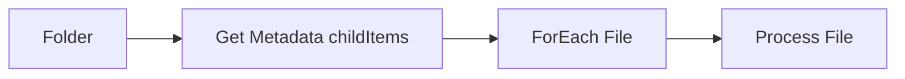

---

## 17. Orchestrated DAG Pattern

### What it is

Represent the pipeline as explicit dependent activities rather than hidden sequencing.

### Typical use case

- multi-step ETL,
- pipelines with branching and merge points,
- teams that need clear operational flow.

### How to do it in ADF

1. Keep each activity focused.
2. Use explicit dependencies instead of embedding too much logic in expressions.
3. Group related logic into child pipelines when the canvas becomes noisy.

### Main ADF activities/components

- pipeline dependencies
- `Execute Pipeline`
- `If Condition`
- `ForEach`
- `Data Flow`

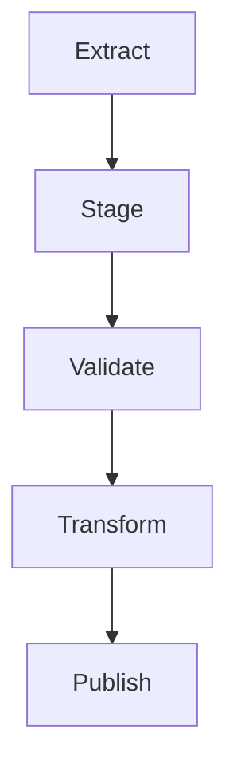

---

## 18. CDC-to-Target Pattern

### What it is

Consume inserts, updates, and deletes rather than full snapshots.

### Typical use case

- operational data sync,
- near-real-time replication,
- high-volume source tables.

### How to do it in ADF

ADF can orchestrate this pattern, but the CDC capture source and target merge design matter more than the canvas:

1. Source emits changes or exposes CDC tables/logs.
2. Use `Copy Data` or source query to extract changes.
3. Stage change records.
4. Use `Stored Procedure` or `Data Flow` to apply insert/update/delete behavior downstream.
5. Persist high-water marks.

### Main ADF activities/components

- `Copy Data`
- `Lookup`
- `Stored Procedure`
- `Data Flow`
- parameters and watermark storage

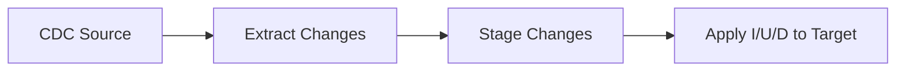

---

# ADF Antipattern Catalog

## 1. One Giant Pipeline Canvas

### What it looks like

Dozens of activities, nested branches, shared variables everywhere, and no meaningful modularization.

### Why it hurts

- hard to debug,
- hard to reuse,
- easy to break,
- difficult for others to understand.

### Better approach

Use `Execute Pipeline`, modular pipelines, and smaller responsibility boundaries.

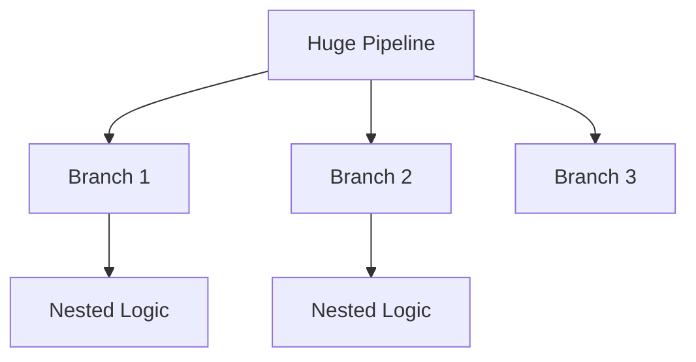

---

## 2. Business Logic Hidden in Dynamic Expressions

### What it looks like

Critical rules are buried in long ADF expressions, dataset parameters, and activity JSON.

### Why it hurts

- logic is unreadable,
- testing is weak,
- debugging becomes expression archaeology.

### Better approach

Move heavy business logic into SQL, `Stored Procedure`, or `Data Flow`, and keep the pipeline as orchestration.

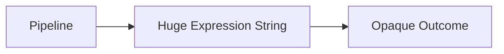

---

## 3. Copy Activity Used as a Universal Hammer

### What it looks like

Trying to solve every transformation, validation, and publishing problem with `Copy Data` alone.

### Why it hurts

- weak semantic controls,
- awkward branching,
- hidden assumptions in source/sink mappings.

### Better approach

Use `Copy Data` for movement, `Data Flow` or SQL for transformation, and explicit control flow for gating.

```mermaid
flowchart LR
    A["All Problems"] --> B["Copy Activity"]
    B --> C["Overloaded Pipeline"]
```

---

## 4. No Raw Landing Zone

### What it looks like

Source data is transformed immediately into curated outputs with no raw retention.

### Why it hurts

- replay is painful,
- debugging is weak,
- source disputes cannot be verified.

### Better approach

Introduce a raw landing layer with `Copy Data`.

```mermaid
flowchart LR
    A["Source"] --> B["Immediate Transform"]
    B --> C["No Raw Trace"]
```

---

## 5. Validation Only After Publish

### What it looks like

Data is loaded into serving tables first, then checked later.

### Why it hurts

- consumers can see bad data,
- rollback becomes operational cleanup.

### Better approach

Validate before publish using `Get Metadata`, `Lookup`, `If Condition`, and `Data Flow`.

```mermaid
flowchart LR
    A["Load to Final"] --> B["Check Later"]
    B --> C["Consumers Already Hit It"]
```

---

## 6. ForEach Explosion

### What it looks like

A `ForEach` loop spins up too many parallel tasks with weak control over source limits and sink contention.

### Why it hurts

- source throttling,
- sink locking,
- inconsistent runtimes,
- noisy failures.

### Better approach

Tune `ForEach` concurrency deliberately, batch similar work, or orchestrate via child pipelines.

```mermaid
flowchart LR
    A["ForEach 500 Items"] --> B["Parallel Storm"]
    B --> C["Rate Limits / Contention"]
```

---

## 7. Watermark Logic Without Reconciliation

### What it looks like

Incremental pipelines trust the watermark completely and never compare full source vs target behavior.

### Why it hurts

- silent drift accumulates,
- missed changes remain invisible.

### Better approach

Pair incremental loads with periodic reconciliation checks.

```mermaid
flowchart LR
    A["Watermark Extract"] --> B["Merge"]
    B --> C["Target Drift Over Time"]
```

---

## 8. Quarantine Without Owner

### What it looks like

Reject files/rows are stored, but nobody reviews them.

### Why it hurts

- quality debt becomes invisible,
- bad upstream behavior never gets fixed.

### Better approach

Add owner, SLA, and remediation flow. Log reject counts and fail when thresholds are too high.

```mermaid
flowchart LR
    A["Rejected Data"] --> B["Quarantine"]
    B --> C["Nobody Looks"]
```

---

## 9. Logging Only Pipeline Success/Failure

### What it looks like

The only thing tracked is whether the activity turned green or red.

### Why it hurts

- “green” pipelines can still publish wrong data,
- operations sees infra state, not data trust.

### Better approach

Log row counts, freshness, rule violations, reconciliation results, and publish decisions.

```mermaid
flowchart LR
    A["Pipeline Green"] --> B["No Quality Context"]
    B --> C["False Confidence"]
```

---

## 10. Parent Pipeline as Manual Switchboard

### What it looks like

One parent pipeline contains endless `If Condition` and `Switch` branches for every special case.

### Why it hurts

- branching logic grows faster than maintainability,
- each new exception makes the whole factory harder to reason about.

### Better approach

Move exceptions into metadata-driven configuration and reusable child pipelines.

```mermaid
flowchart TD
    A["Master Pipeline"] --> B["If A"]
    A --> C["If B"]
    A --> D["If C"]
    B --> E["Special Branch"]
    C --> F["Special Branch"]
```

---

# ADF Activity Quick Reference by Intent

## Move data

- `Copy Data`

## Transform row-level data

- `Data Flow`
- SQL transformations outside ADF

## Read control/configuration

- `Lookup`
- `Get Metadata`

## Branch / loop / orchestrate

- `If Condition`
- `Switch`
- `ForEach`
- `Until`
- `Execute Pipeline`

## Wait / dependency handling

- `Validation`
- `Wait`

## Fail fast / stop intentionally

- `Fail`

## Write logs / call downstream systems

- `Stored Procedure`
- `Web`

## Maintain file targets

- `Delete`

---

# Design Rule of Thumb for ADF

ADF is strongest when you use it mainly as:

- orchestrator,
- data mover,
- control-flow engine,
- pipeline shell around SQL or Mapping Data Flow logic.

ADF becomes fragile when you try to force it to be:

- your only validation framework,
- your only semantic rules engine,
- your only metadata store,
- your only monitoring platform.

The practical design target is:

`ADF for orchestration + storage for raw/history + SQL/Data Flow for transformation + explicit quality gates for trust`
