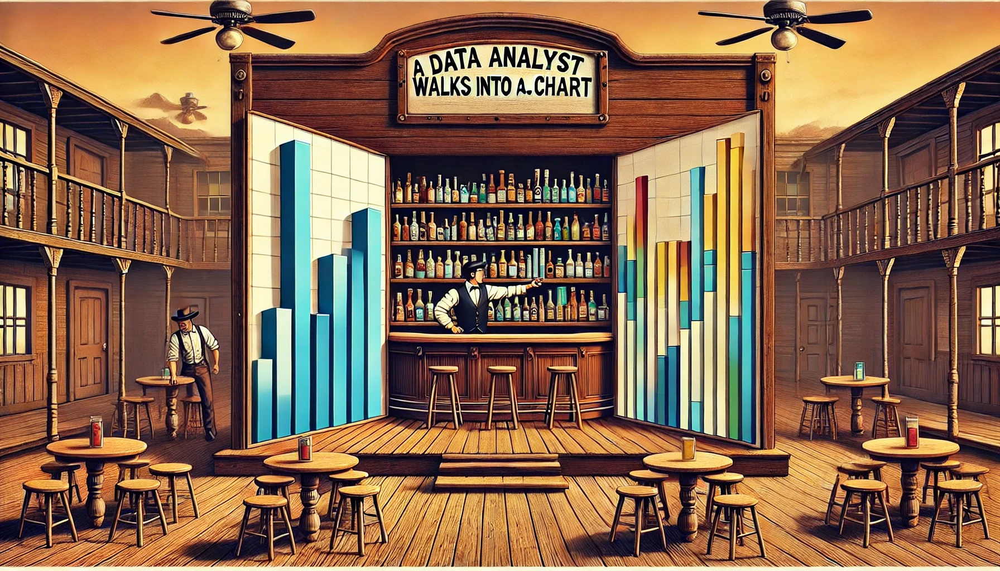

## **Why Are Bar Charts So Common?**

A data analyst walks into a bar… **chart.** It’s the most familiar, widely used visualization out there—**reliable, straightforward, and effective.** But just like a **well-poured drink**, the details **matter**.

Bar charts are the **workhorse of data visualization**. They’re everywhere in **business reports, dashboards, and presentations** because they are:\
✔ **Easy to read** – We instinctively compare bar lengths.\
✔ **Flexible** – They work for both **absolute values and comparisons**.\
✔ **Scalable** – From **simple to complex**, bar charts can handle large datasets.

But here’s the thing—**not all bar charts are created equal.** Misuse them, and they can **mislead, confuse, or overwhelm** the audience.

So, before we start **stacking, grouping, or flipping bars around**, let’s take a step back and explore:\
🔹 **Why bar charts work so well.**\
🔹 **Where they shine—and where they fail.**\
🔹 **How to avoid the biggest bar chart mistakes.**

Because in data visualization, just like in the Wild West, **knowing the right tool for the job makes all the difference.**

## **Core Bar Chart Types: How & When to Use Them**

Bar charts may seem simple, but they come in **many flavors**—and **choosing the right one** can make or break your visualization. Each variation serves a different purpose, and using the wrong one can lead to **misinterpretation or clutter**.

Let’s walk through the **core types of bar charts**, when to use them, and where they often go wrong.

### **📊 Standard Bar Chart & Column Chart – The Classic Workhorses**

✔ **What they are:**

-   **Bar Chart** – A **horizontal** representation of categorical data.

-   **Column Chart** – A **vertical** version of the bar chart, often used for **sequential categories** like months or years.

✔ **Best for:**

-   **Comparing discrete categories** (e.g., **Sales by Region**, **Expenses by Department**).

-   **Ranking items** (e.g., **Top 10 Products by Revenue**).

-   **Tracking sequential data** (Column Chart works better for **monthly trends**).

❌ **Common mistakes:**

-   **Too many bars** – Overcrowding kills readability.

-   **Random sorting** – Always **order bars logically** (by value or categorical sequence).

-   **Not starting at zero** – A **truncated y-axis distorts comparisons**.

-   **Using a column chart for non-sequential categories** – If there's no natural order, a horizontal bar chart is often better.

🔀 **Variations:**

-   **Column Chart (Vertical Bar Chart)** – Great when **categories follow a natural order** (e.g., time-based data).

-   **Lollipop Chart** – A more modern and minimalist version of a bar chart, useful when many bars have **similar values**.

🆚 **Better alternatives?**

-   If the **number of categories is too large**, consider a **dot plot**.

    -   If you need to **track changes over time**, a **line chart** is often clearer than a column chart.

```{r}
#| echo: false
#| message: false
#| warning: false
library(ggplot2)

# Sample data: Simulating a Superstore-style dataset
data <- data.frame(
  Category = c("Furniture", "Office Supplies", "Technology"),
  Sales = c(50000, 75000, 120000)
)

# Basic bar chart
ggplot(data, aes(x = Category, y = Sales, fill = Category)) +
  geom_bar(stat = "identity") +
  labs(title = "Sales by Category",
       x = "Category",
       y = "Total Sales") +
  theme_minimal() +
  theme(legend.position = "none")
```

### **📊 Stacked Bar Chart – A Part-to-Whole Breakdown**

✔ **What it is:** A standard bar chart where each bar is divided into segments representing different subcategories.\
✔ **Best for:** **Showing proportions within a category** (e.g., Revenue by Region split by Product Type).\
❌ **Common mistakes:**

-   **Too many segments** make comparisons hard.

-   Using **too many colors** (confuses the audience).

-   Hard to compare **segment values across bars** unless one stays constant.\
    🔀 **Variations:**

-   **100% Stacked Bar Chart** (forces each bar to sum to 100%, good for relative comparisons).\
    🆚 **Better alternatives?** If exact values matter, **grouped bar charts** or **treemaps** might work better.

```{r}
#| echo: false
#| message: false
#| warning: false
library(ggplot2)

# Sample data: Simulating a Superstore-style dataset
data <- data.frame(
  Category = rep(c("Furniture", "Office Supplies", "Technology"), each = 3),
  SubCategory = rep(c("Chairs", "Tables", "Storage"), times = 3),
  Sales = c(20000, 15000, 15000, 30000, 25000, 20000, 50000, 40000, 30000)
)

# Stacked bar chart
ggplot(data, aes(x = Category, y = Sales, fill = SubCategory)) +
  geom_bar(stat = "identity") +
  labs(title = "Sales by Category and Sub-Category",
       x = "Category",
       y = "Total Sales",
       fill = "Sub-Category") +
  theme_minimal()

```

### **📊 Grouped Bar Chart – Side-by-Side Comparisons**

✔ **What it is:** Bars are placed **next to each other** within each category instead of stacked.\
✔ **Best for:** **Comparing multiple series across categories** (e.g., Monthly Sales by Product Type).\
❌ **Common mistakes:**

-   **Too many groups** make it unreadable.

-   **Bars too close or too far apart**, making comparisons difficult.\
    🔀 **Variations:**

-   **Clustered Bar Chart** (same concept, different naming).\
    🆚 **Better alternatives?** If comparing trends, consider **line charts** instead.

```{r}
#| echo: false
#| message: false
#| warning: false
library(ggplot2)

# Sample data: Simulating a Superstore-style dataset
data <- data.frame(
  Category = rep(c("Furniture", "Office Supplies", "Technology"), each = 3),
  SubCategory = rep(c("Chairs", "Tables", "Storage"), times = 3),
  Sales = c(20000, 15000, 15000, 30000, 25000, 20000, 50000, 40000, 30000)
)

# Grouped bar chart
ggplot(data, aes(x = Category, y = Sales, fill = SubCategory)) +
  geom_bar(stat = "identity", position = position_dodge()) +
  labs(title = "Sales by Category and Sub-Category (Grouped)",
       x = "Category",
       y = "Total Sales",
       fill = "Sub-Category") +
  theme_minimal()

```

### **📊 Waterfall Chart – Showing Change Step by Step**

✔ **What it is:** A modified bar chart where each bar represents a step in a cumulative total (e.g., revenue breakdown).\
✔ **Best for:** **Showing incremental changes** (e.g., Profit Breakdown: Revenue → Costs → Net Profit).\
❌ **Common mistakes:**

-   Not using **clear labels** (hard to follow the flow).

-   Using it for data that **doesn’t have a logical step-by-step progression**.\
    🔀 **Variations:**

-   **Bridge Chart** (another name for the same concept).\
    🆚 **Better alternatives?** For simple before/after comparisons, use **a standard bar chart**.

```{r}
#| echo: false
#| message: false
#| warning: false
library(ggplot2)
library(dplyr)

# Sample data: Simulating profit contribution (Superstore-style)
data <- data.frame(
  Category = c("Revenue", "COGS", "Operating Exp.", "Marketing", "Net Profit"),
  Value = c(100000, -40000, -20000, -15000, 25000)
)
data$Category <- factor(data$Category, 
                        levels = c("Revenue", "COGS", "Operating Exp.", "Marketing", "Net Profit"), 
                        ordered = TRUE)

# Calculate cumulative positions
data <- data %>%
  mutate(End = cumsum(Value),
         Start = lag(End, default = 0),
         Type = ifelse(Value >= 0, "Increase", "Decrease"))

# Waterfall chart
ggplot(data, aes(x = Category, y = Value, fill = Type)) +
  geom_rect(aes(x = Category, xmin = as.numeric(factor(Category)) - 0.4,
                xmax = as.numeric(factor(Category)) + 0.4,
                ymin = Start, ymax = End), color = "black") +
  scale_fill_manual(values = c("Increase" = "forestgreen", "Decrease" = "red")) +
  labs(title = "Waterfall Chart: Profit Breakdown",
       x = "Category",
       y = "Value",
       fill = "Change Type") +
  theme_minimal()

```

### **📊 Bullet Chart – A Smarter KPI Tracker**

✔ **What it is:** A compact variation of a bar chart that includes **targets, benchmarks, and actual values** in one visual.\
✔ **Best for:** **Comparing performance against a goal** (e.g., Sales Target vs. Actual Sales).\
❌ **Common mistakes:**

-   **Overloading with too many comparisons.**

-   **Using colors that don’t clearly indicate progress.**\
    🔀 **Variations:**

-   Sometimes combined with **bar-in-bar comparisons**.\
    🆚 **Better alternatives?** If you need more precision, consider **a simple table with conditional formatting**.

```{r}
#| echo: false
#| message: false
#| warning: false
library(ggplot2)

# Sample data: Simulating a performance dashboard
data <- data.frame(
  Metric = "Sales Target",
  Actual = 75000,  # Actual sales
  Target = 100000, # Target sales
  Good = 90000,    # Good performance threshold
  Excellent = 110000 # Excellent performance threshold
)

# Bullet chart
ggplot(data) +
  # Background performance zones
  geom_bar(aes(x = Metric, y = Excellent), stat = "identity", fill = "lightgray", width = 0.6) +
  geom_bar(aes(x = Metric, y = Good), stat = "identity", fill = "gray", width = 0.6) +
  geom_bar(aes(x = Metric, y = Target), stat = "identity", fill = "darkgray", width = 0.6) +
  # Actual performance bar
  geom_bar(aes(x = Metric, y = Actual), stat = "identity", fill = "steelblue", width = 0.3) +
  # Target marker
  geom_hline(aes(yintercept = Target), linetype = "dashed", color = "red", size = 1) +
  labs(title = "Bullet Chart: Sales Performance",
       x = "",
       y = "Sales",
       caption = "Blue = Actual Sales, Dashed Line = Target, Background = Performance Ranges") +
  theme_minimal() +
  coord_flip() +
  theme(axis.text.x = element_blank(), axis.ticks.x = element_blank())

```

### **📊 Mekko (Marimekko) Chart – When Categories Have Different Weights**

✔ **What it is:** A bar chart where **both height and width** carry meaning (often used for **market share analysis**).\
✔ **Best for:** **Visualizing distributions across two dimensions** (e.g., Market Size by Region and Product).\
❌ **Common mistakes:**

-   **Difficult to read without labels**.

-   **Not intuitive for casual users**.\
    🔀 **Variations:**

-   Also called **Mosaic Chart**.\
    🆚 **Better alternatives?** If only one variable needs emphasis, a **stacked bar chart** is easier to interpret.

```{r}
#| echo: false
#| message: false
#| warning: false
library(ggplot2)
library(dplyr)

# Sample data: Simulating market share by region and product category
data <- data.frame(
  Category = rep(c("Furniture", "Office Supplies", "Technology"), each = 3),
  Region = rep(c("North", "South", "West"), times = 3),
  Sales = c(30000, 20000, 50000, 40000, 25000, 35000, 60000, 45000, 55000)
)

# Step 1: Compute total sales per category
category_totals <- data %>%
  group_by(Category) %>%
  summarise(Total_Sales = sum(Sales), .groups = "drop")

# Step 2: Compute cumulative X positions for category widths
category_totals <- category_totals %>%
  mutate(Xmin = cumsum(lag(Total_Sales, default = 0)) / sum(Total_Sales),
         Xmax = Xmin + (Total_Sales / sum(Total_Sales)))

# Step 3: Merge back to original data and compute regional stacking within each category
data <- data %>%
  left_join(category_totals, by = "Category") %>%
  group_by(Category) %>%
  arrange(Region) %>%  # Ensure stacking order is consistent
  mutate(Ymin = cumsum(lag(Sales, default = 0)) / Total_Sales,  
         Ymax = Ymin + (Sales / Total_Sales))

# Step 4: Create the Mekko chart
ggplot(data) +
  geom_rect(aes(xmin = Xmin, xmax = Xmax, ymin = Ymin, ymax = Ymax, fill = Region), color = "black") +
  labs(title = "Marimekko Chart: Market Share by Category and Region",
       x = "Category Proportion",
       y = "Regional Market Share",
       fill = "Region") +
  theme_minimal()

```

### **Final Thoughts on Bar Chart Variants**

Bar charts **may seem basic**, but choosing the right type **can make or break your visualization.**

✔ **Standard bar charts** are great for comparisons, but **sorting matters**.\
✔ **Stacked bars** work for part-to-whole, but **too many segments can get messy**.\
✔ **Grouped bars** help compare series, but **too many groups hurt readability**.\
✔ **Waterfalls explain changes**, but only if the steps **make logical sense**.\
✔ **Bullet charts track performance**, but **don’t overcomplicate them**.\
✔ **Mekko charts show complex relationships**, but **can confuse casual viewers**.

Choosing the right one **depends on the story you want to tell**.

## **When to Use Bar Charts (And When Not To!)**

Bar charts are **everywhere** in data visualization, but **just because they’re common doesn’t mean they’re always the best choice**. While they excel at comparing categorical values, they can quickly become **misleading or ineffective** when used incorrectly.

Let’s explore:\
✔ **When bar charts work best**\
❌ **When they fail**\
🔄 **What alternatives to consider in those cases**

### **✔ When to Use Bar Charts**

**✅ 1. Comparing discrete categories**

-   **Best for**: Sales by Region, Expenses by Department, Top 10 Products, etc.

-   **Why**: Bars make it easy to compare absolute values across distinct groups.

**✅ 2. Ranking items in order**

-   **Best for**: Showing highest to lowest performance, sorting KPIs, revenue leaders, etc.

-   **Why**: Sorted bars highlight the biggest and smallest contributors instantly.

**✅ 3. Showing part-to-whole relationships (stacked bars)**

-   **Best for**: Market share, budget breakdowns, sales by product category.

-   **Why**: Allows for relative comparison while still showing absolute values.

-   **⚠ Caution**: If segment sizes are important, **a treemap might be better**.

**✅ 4. Tracking categorical changes over time (column charts)**

-   **Best for**: Monthly revenue by category, yearly budget comparisons.

-   **Why**: Works well **if each time period is distinct** and **does not require trend analysis**.

-   **⚠ Caution**: If tracking smooth trends, **a line chart is more effective**.

### **❌ When Not to Use Bar Charts**

**🚫 1. When comparing continuous trends over time**

-   **Bad example**: Monthly sales performance over several years in a bar chart.

-   **Why**: Bars force readers to compare **discrete blocks**, while trends are best visualized **as a continuous flow**.

-   ✅ **Use a line chart instead!**

**🚫 2. When there are too many categories**

-   **Bad example**: A bar chart with 50+ products, making it unreadable.

-   **Why**: Bars become tiny and difficult to compare.

-   ✅ **Consider a dot plot or small multiples!**

**🚫 3. When exact values matter more than shape**

-   **Bad example**: A bar chart showing precise financial figures where small differences matter.

-   **Why**: Bars make it hard to see exact values at a glance.

-   ✅ **Use a table with conditional formatting instead!**

**🚫 4. When showing hierarchy or nested proportions**

-   **Bad example**: A stacked bar chart with too many segments, making it unreadable.

-   **Why**: The eye struggles to compare part-to-whole relationships when segments are misaligned.

-   ✅ **Use a treemap or Marimekko chart instead!**

### **🔄 Alternatives to Bar Charts**

📌 **Line Charts** – When tracking trends over time.\
📌 **Dot Plots** – When comparing many categories.\
📌 **Treemaps** – When showing hierarchical proportions.\
📌 **Heatmaps** – When displaying complex categorical relationships.

### **Final Thoughts**

Bar charts are one of the most **versatile** tools in data visualization, but **choosing the right variation** and **knowing when to use an alternative** can make all the difference.

✔ Use bar charts when **comparing discrete categories, ranking items, or showing part-to-whole relationships.**\
❌ Avoid them for **time series trends, highly detailed comparisons, and hierarchical structures.**\
🔄 Always consider whether another visualization type **tells the story more effectively!**

## **Pro Tips & Best Practices for Bar Charts**

Bar charts are one of the most **intuitive** and **widely used** chart types, but **small design mistakes** can easily distort insights or make the chart harder to read. Here are some **best practices** to ensure your bar charts communicate data **effectively and accurately**.

### **✔ 1. Always Start the Axis at Zero**

❌ **Bad Example**: A bar chart with a truncated y-axis (starting at a non-zero value).

-   **Why it’s misleading**: It **exaggerates small differences**, making them look much larger than they actually are.

✅ **Best Practice**: Always set the **y-axis to start at zero**, ensuring fair comparisons.

### **✔ 2. Sort Bars in a Logical Order**

❌ **Bad Example**: Randomly ordered categories.

-   **Why it’s bad**: Viewers struggle to compare values quickly.

✅ **Best Practice**: Sort bars by **value (descending order)** or **logical sequence**.

### **✔ 3. Avoid Overcrowding with Too Many Bars**

❌ **Bad Example**: A bar chart with 50+ categories, making bars unreadable.

-   **Why it’s bad**: Cluttered bars make comparisons difficult.

✅ **Best Practice**:

-   Use **dot plots** if there are too many categories.

-   Consider **grouping categories into "Other"** when there are many small values.

### **✔ 4. Be Careful with Stacked Bar Charts**

❌ **Bad Example**: A stacked bar chart with **too many segments**, making it impossible to compare categories.

-   **Why it’s bad**: Only the **first segment (bottom bar) is easy to compare**, while the rest become confusing.

✅ **Best Practice**: Use stacked bars **only when comparing part-to-whole relationships**.

-   If comparing across multiple categories, **grouped bar charts are clearer**.

### **✔ 5. Label Bars When Possible**

❌ **Bad Example**: A chart with no labels, forcing users to rely on a separate legend.

-   **Why it’s bad**: Makes interpretation slower and less intuitive.

✅ **Best Practice**: Use **direct labeling** instead of legends when feasible.

### **Final Thoughts**

✔ **Start axes at zero** to avoid distorting differences.\
✔ **Sort bars logically** to improve readability.\
✔ **Limit the number of bars** to prevent clutter.\
✔ **Use stacked bars wisely**—consider grouped bars or alternatives.\
✔ **Label bars directly** instead of relying on a separate legend.

By following these **best practices**, bar charts remain **clear, effective, and honest representations of data**.

## **Conclusion**

Bar charts are **simple yet powerful** tools for comparing categories, but **design choices can make or break their effectiveness**. By following **best practices**, we can ensure they remain **clear, accurate, and easy to interpret**.

### **🎯 Key Takeaways**

✔ **Bar charts excel at comparisons** – They are ideal for **ranking, part-to-whole relationships, and categorical breakdowns**.

✔ **Column charts work better for time-based data** – If the data represents **months, years, or sequential categories**, a **vertical column chart** is often better.

✔ **Sorting matters** – Always **order bars logically**, either by value (descending) or a **natural sequence** like time or category hierarchy.

✔ **Avoid overcrowding** – Too many bars? **Use a dot plot, small multiples, or group smaller categories into "Other."**

✔ **Stacked bars should be used with care** – If **precise comparisons** between segments are needed, consider a **grouped bar chart** or a **treemap instead**.

✔ **Always start axes at zero** – **Truncated axes distort comparisons**, making differences appear larger than they actually are.

✔ **Label directly when possible** – Direct labels **reduce cognitive load**, making the chart easier to read.

### **🚀 Choosing the Right Chart**

Before defaulting to a bar chart, ask yourself:

✅ **Do I need to compare categories?** – If yes, bar charts work well.\
✅ **Am I comparing trends over time?** – Use a **line chart instead**.\
✅ **Do I have too many categories?** – Consider **dot plots** or **treemaps**.\
✅ **Is part-to-whole important?** – Use **stacked bars** but be mindful of readability.\
✅ **Am I tracking a goal?** – A **bullet chart** might be more effective.

### **🔄 What’s Next?**

This was just the **first episode** in the *Anatomy of a Chart* series! Next, we’ll dive into:

**📈 Episode 2: Line-Based Charts – When to Use Trends and When to Avoid Them**

Where we’ll cover:\
🔹 **When to use line charts vs. area charts.**\
🔹 **Common mistakes with line charts.**\
🔹 **Best practices for trend visualization.**

Stay tuned for the next installment! 🚀

### Related Reading

If you want to continue with a closely related topic:

-   [Now You See It, Now You Don't – Dynamic Zone Visibility in Tableau](2025-02-16_Dynamic_Zone_Visibility.qmd)
-   [Connecting the Dots: When Line Charts Are Your Best Friend](2025-03-02_Chart_anatomy_line.qmd)
