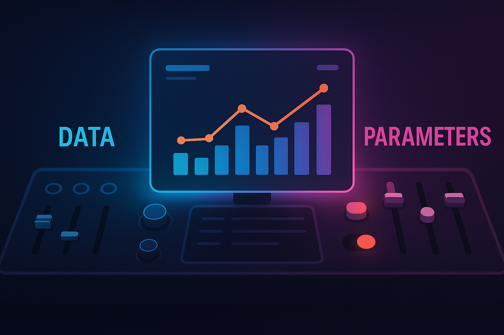

## **The Dashboard That Thinks Back**

Most dashboards look like they’re answering questions.\
But the best ones let you **ask new ones**.

Not with code. Not with SQL.\
But with sliders, switches, and dropdowns — all quietly powered by something deceptively powerful: **parameters**.

### 🔹 The Illusion of Simplicity

At a glance, BI tools look like simple aggregators:

-   Show me sales by region.

-   Filter to the last quarter.

-   Slice by category.

But users don’t stay in “report” mode for long. They want to compare, explore, adjust:

>  “What if we dropped the discount by 5%?”\
> “What if we looked at profit per product, not revenue?”\
> “What if we defined ‘high value’ customers differently?”

Most tools don’t have a true programming language embedded — but they **do have parameters**.\
And in BI, **parameters are the closest thing we get to variables.**

### 🧠 Why This Article Exists

This article is about **turning static dashboards into interactive thinking tools**.\
It’s about:

-   Making dashboards smarter without overcomplicating them

-   Treating users as decision-makers, not just readers

-   Designing logic that **responds** instead of just reports

Because modern BI isn’t just about delivering data.

>  It’s about creating interfaces where **logic adapts**, not just data flows.

## **1️⃣ Variables, Parameters, and the Illusion of Flexibility**

At first glance, dashboards look dynamic. They have filters. Maybe slicers. Maybe a date picker.

But if you’ve ever tried to build a dashboard for more than one question, you know the truth:

> 
>
> Most dashboards are flexible only on the surface.\
> Underneath, they’re hard-coded to answer one type of question in one way.

This is where parameters come in — not as a UX gimmick, but as a **conceptual shift**.

### 🧠 What’s the Difference Between Data and Variables?

| Concept | In BI Terms | Example |
|----|----|----|
| **Data Field** | A static column from your dataset | `Sales`, `Customer Segment`, `Order Date` |
| **Filter** | A constraint applied to a field | Region = "West" |
| **Parameter** | A dynamic input, not tied to a field | “Threshold = 10%”, “Metric to show = Profit” |
| **Variable (in logic)** | A flexible placeholder in formulas | `Selected_Measure`, `ScenarioRate` |

Most BI tools don’t give you true variables like you'd find in code.\
But parameters fill that gap:

-   They let **users control logic** without editing a formul

-   They allow **calculations to respond** to input

-   They transform dashboards from static summaries into **decision sandboxes**

### 📊 Example: The KPI Switcher

Let’s say your dashboard tracks revenue, profit, and margin.

You could:

-   Create three charts

-   Or three pages

-   Or… one parameter called `Selected KPI`

In Tableau:

```         
CASE [Selected KPI]
WHEN "Revenue" THEN [Revenue]
WHEN "Profit" THEN [Profit]
WHEN "Margin" THEN [Margin]
END
```

In Power BI:

```         
KPI_Value = 
SWITCH(
    SELECTEDVALUE('KPI Selector'[Metric]),
    "Revenue", [Total Revenue],
    "Profit", [Total Profit],
    "Margin", [Profit Margin]
)
```

That one parameter replaces multiple visuals, rewrites logic on the fly, and gives users control over **what question they’re asking** — without changing the data.

### 🔍 The Illusion, Revealed

Filters change *what* you see.\
**Parameters change *how* the dashboard thinks.**

That’s the core difference. And it’s why you should start designing **for logic control**, not just layout and data.

## **2️⃣ Where Parameters Show Up — From UX to Logic Switching**

Parameters don’t always announce themselves — but they’re doing heavy lifting behind the scenes.\
They show up in **user controls**, in **calculations**, in **filters**, and sometimes in how a dashboard tells its story.

Let’s break down the core areas where parameters add value — and how they work differently from basic filters or slicers.

### 🔹 1. **Visual Control: One View, Many Possibilities**

Parameters often power dynamic user interfaces:

-    **KPI selector** → Switch between profit, revenue, margin

-   **Granularity control** → Daily, weekly, monthly aggregation

-   **Chart toggle** → Bar vs line vs area view

-   **Sort logic** → “Top by Revenue” vs “Top by Quantity Sold”

These interactions go beyond filtering — they **alter the structure** or **shape** of what the user sees.

### 🔹 2. **Calculation Logic: Adaptive Formulas**

Parameters can change **how a metric is calculated**, not just which rows are shown.

Examples:

-   Threshold-based classification:

    > “Flag any product with margin \< \[Parameter: Margin Threshold\]”

-   Dynamic comparisons:

    > “% change vs \[Parameter: Comparison Period\]”

-   Switching logic branches:

    > “If user selects ‘Scenario A’, apply one formula; otherwise, apply another”

This moves BI logic closer to **modeling**, not just visualization.

### 🔹 3. **Filtering Behavior That Isn’t Bound to Fields**

Filters are great — until they don’t fit the business question.

Parameters let you:

-   **Filter by values that don’t exist yet** (e.g. enter a custom region or threshold)

-   **Apply logic to dimensions that don’t belong in the visual**

-   **Control what “active” or “important” means**, instead of hardcoding it

You define the filter logic, and the parameter just **plugs into it**.

### 🔹 4. **Interface Logic: Dynamic Layouts and UX**

Especially in Tableau (and partially in Power BI), parameters can control:

-   Show/hide containers

-   Change titles and annotations

-   Control navigation (e.g. show different dashboards based on selection)

They’re the key to building **dashboards that feel responsive and tailored** — like tools, not just charts.

### 🧠 Summary Insight

>  Parameters don’t just let users pick a value —\
> they let users shape **what kind of logic the dashboard executes.**

You don’t need hundreds of dashboards.\
You need a handful that can **adapt intelligently.**

## **3️⃣ What-If Scenarios — From Reporting to Simulation**

Most dashboards are great at **telling you what happened**.\
But what if you want to ask:

>  “What would happen if we changed something?”

This is where **parameters go from useful to transformative**.\
With a few well-placed inputs, you can turn a dashboard from a passive summary into a lightweight **simulation engine** — a tool for **testing assumptions** and **making strategic decisions**.

### 🔹 What Counts as a What-If?

A what-if scenario allows users to manipulate **an input** and instantly see **how outputs change**.\
Common use cases include:

| Scenario | Parameter Example | Metric Impact |
|----|----|----|
| Change discount rate | Slider: 0–30% | Affects profit margin & revenue |
| Test growth assumptions | Dropdown: 5%, 10%, 15% | Forecasts next year’s sales |
| Currency conversion | FX rate input (e.g. 1.08) | Changes all financial metrics |
| Adjust cost of goods | Numeric input | Recalculates profitability |
| Employee attrition | Scenario toggle: Low / Med / High | Forecasts future headcount and cost impact |

These aren't just filters — they're inputs that drive **business logic**.

### 🔧 How It's Done in BI Tools

#### 🟣 **Power BI**

-    Use a **What-If Parameter Table** (with DAX-generated slicer)

-   Reference `SELECTEDVALUE()` in your measures:

    ```         
    Adjusted Profit = [Profit] * (1 - SELECTEDVALUE('Discount Rate'[Value]))
    ```

#### 🔵 **Tableau**

-   Create a **Parameter** (numeric, dropdown, etc.)

-   Use it in calculated fields:

    ```         
    [Adjusted Profit] = [Profit] * (1 - [Discount Parameter])
    ```

In both cases, you're using parameters as **substitutes for variables** — letting users plug in hypothetical values to drive real calculations.

### 💡 Example: Scenario Planning Tile

You could design a single tile with:

-   Parameter: Growth Rate (5%, 10%, 15%)

-   Parameter: Discount Policy (slider)

-   Output: Revenue Forecast, Profit Impact, High-Risk Product Count

The result?\
One screen — many potential futures.\
A dashboard that doesn’t just report but **thinks** with the user.

### 🧠 Insight

>  Parameters turn dashboards into decision tools.\
> They move analysis from *what was* to *what could be*.

What-if dashboards don’t replace forecasting models — but they **bridge the gap between insight and action**.

## **4️⃣ Best Practices for Designing with Parameters**

Parameters are powerful — but they can also backfire.

Used well, they make dashboards feel intelligent, responsive, and empowering.\
Used poorly, they confuse users, clutter interfaces, and increase maintenance cost.

Let’s talk about **how to use parameters thoughtfully**, so they remain tools — not traps.

### ✅ 1. **Name Like a Developer, Label Like a Human**

-   Internal parameter names should be clear and specific (`Selected_KPI`, `DiscountThreshold`)

-   User-facing labels should be friendly and meaningful:\
    “Choose a Metric to Compare” instead of “SelectKPI1”

-   Add tooltips where possible to explain what the parameter does

### ✅ 2. **Set Smart Defaults**

-   Choose a default that reflects the most common or safest value

-   Avoid defaulting to edge cases (“Show me Top 1000 Customers” on first load = 🔥)

-   In simulations, start neutral (e.g., “0% change”) to create baseline expectations

### ✅ 3. **Don’t Overload the User**

More parameters ≠ more power. It just means more complexity.

-   If you're using more than 3–4 parameters on one view, reconsider your UX

-   Group related parameters together using visual hierarchy or layout

-   Consider step-by-step flows for scenario planning (e.g., input → output)

### ✅ 4. **Make Changes Observable**

When a user changes a parameter, show them the effect:

-   Dynamic titles: “Profit Margin with X% Discount”

-   Highlight updated KPIs visually (icons, animation, color change)

-   Use calculated fields in tooltips to explain “why this number changed”

### ✅ 5. **Document the Logic Behind the Parameter**

Especially when the parameter changes calculation paths or logic:

-   Annotate your calculated fields (Power BI: descriptions, Tableau: comments)

-   Keep a definitions sheet or “how to use this dashboard” section

-   Consider a toggle for “show logic/explanation” in the UI for complex dashboards

### ✅ 6. **Keep Performance in Mind**

Some parameter-driven logic can increase query complexity:

-   Avoid chaining too many parameters into long nested formulas

-   Test performance in live environments

-   For large models, consider pre-aggregated outputs where possible

### 🧠 Final Tip

>  **Parameters should guide, not overwhelm.**\
> If your dashboard feels like a cockpit — maybe it's time to simplify.

Sometimes the most powerful parameter is one you decide **not** to show.

## **5️⃣ Final Thoughts — Thinking in Variables, Acting with Parameters**

Business intelligence has come a long way from static reports and rigid dashboards.\
But at the heart of what makes a dashboard *smart* isn’t just a better chart — it’s **better thinking** behind the chart.

And that’s what **parameters** enable.

They give users a way to:

-   Shift logic without writing code

-   Explore outcomes instead of just reading results

-   Ask “what if?” without waiting on a developer

### 🧠 Variables vs Parameters — Revisited

We started with the idea that **data tells us what was**,\
but **variables help us explore what could be**.

BI tools don’t always give us raw variables like in programming —\
but parameters get us close enough:

>  A **parameter is a user-driven variable**\
> embedded in the logic of a dashboard.

Used thoughtfully, parameters make dashboards:

-   Flexible for many users

-   Scalable across scenarios

-   Collaborative between business and BI

### 📣 Final Reminder

If your dashboard answers only one question, it’s a report.\
If it lets users shape the question and explore outcomes,

>  **you’ve built a thinking tool.**

So: **think in variables — act with parameters.**\
Your users will do more than click. They’ll start thinking with you.

### Further Reading

If you want to extend this topic, the next useful steps are:

-   [Dynamic Zone Visibility](2025-02-16_Dynamic_Zone_Visibility.qmd) for interface logic that changes based on context

-   [From Clicks to Insights: A Precise Comparison of Power BI and Tableau Interactivity](2025-02-02_From%20Clicks%20to%20Insights%20A%20Precise%20Comparison%20of%20Power%20BI%20and%20Tableau%20Interactivity.qmd) for broader interaction design tradeoffs
