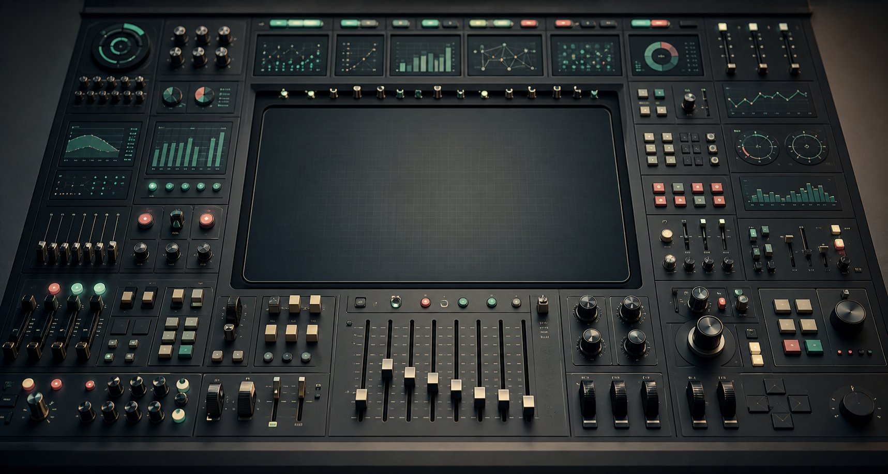

## The Dashboard That Needed an Operator

Some dashboards feel like large church organs.

They are impressive. They have several manuals, many stops, pedals, hidden combinations, and a promise of great power. In the hands of a trained musician, they can produce something rich and precise. But most users did not come to perform a concert. They came to hear one clear melody.

Many reports have the same problem. They contain filters, slicers, toggles, pages, drilldowns, bookmarks, metric selectors, scenario switches, and visual interactions. Each element may have been added for a reasonable reason. Someone asked for a region filter. Someone needed a product selector. Someone wanted to switch between revenue and margin. Someone needed monthly and weekly views. Someone wanted an executive version. Someone wanted details behind the exception.

Nothing looks absurd in isolation.

Together, the report becomes a control panel that only its creator can operate with confidence.

That is the danger. A dashboard can be impressive and still fail its simplest job: helping someone understand what is happening and what to do next.

## Complexity Enters One Reasonable Request at a Time

Dashboard complexity rarely arrives as a bad design decision announced in advance. It enters politely.

The first version answers one question. Then a user asks to break it down by region. That makes sense. Another asks for customer segment. Also reasonable. Finance asks to switch between gross and net revenue. Product asks for a weekly view. Leadership asks for a summary page. Operations asks for exception detail. Someone asks whether the colors can change based on thresholds. Someone else wants the same page, but with a different default filter.

After a few iterations, the dashboard has become something else.

It is no longer a clear answer to a known question. It is a set of possible answers that the user must assemble correctly.

This is where a report crosses a boundary. It stops guiding attention and starts outsourcing design decisions to the viewer.

The problem is not that interactivity is bad. Good dashboards often need interaction. The problem is that interaction can become a substitute for clarity. When the team is not sure what the main question is, it is tempting to give the user every possible path and call that flexibility.

But flexibility is not the same as clarity.

## More Controls Can Mean Less Understanding

Controls are useful when they map to real analytical choices.

A date range can matter. A metric selector can matter. A drilldown can matter. A parameter can let users test assumptions instead of requesting another report. A scenario switch can turn a static dashboard into a thinking tool.

The issue is not the existence of controls. The issue is whether each control has a job.

A filter has a job when it helps the user answer a more precise version of the main question. A parameter has a job when it changes logic deliberately. A page has a job when it supports a distinct stage of understanding. A drilldown has a job when the user needs to move from signal to cause.

Controls become noise when they exist only because the team could not choose.

The dangerous sentence behind many dashboards is:

> We are not sure what they need, so let us give them everything.

That sounds generous. In practice, it often creates interpretive burden. The user has to know which filters matter, which combinations are valid, which views are comparable, which metric definition applies, and which page is the official one. The report becomes less like an answer and more like an unfinished analytical environment.

This can be useful for an analyst.

It is often exhausting for a decision-maker.

## Instructions Are Not a Substitute for Design

Documentation has its place. Complex dashboards need definitions, boundary notes, data freshness information, and sometimes short usage guidance. There is nothing wrong with helping users understand how a report works.

But documentation should not carry the main path.

If a dashboard needs a long training session before it can answer its primary question, the primary question is probably not visible enough. If the author must be in the room to explain which page to use, which filters to ignore, and which number is the "real" one, the report is not self-contained enough for repeated business use.

This does not mean every dashboard must be simple. It means the complexity should be intentional.

There is a difference between:

- documentation that explains definitions, exceptions, and limits,
- documentation that compensates for a confusing structure.

The first is healthy. The second is a warning sign.

A good report can have notes. It should not require a manual before the user can begin.

## The Default View Is a Decision

The default state of a dashboard is not neutral.

It says what the report thinks matters first.

The default date range, default metric, default segment, default sort order, default comparison, default grain, and default filters all shape interpretation before the user touches anything. If those defaults are accidental, the report is making accidental claims.

This is especially important because many users do not explore every possible interaction. They open the dashboard, scan the first page, maybe adjust one filter, and leave with an impression. The first view carries more responsibility than we often admit.

A useful default view should answer the first useful question.

Not every question. Not every edge case. The first useful one.

For an executive dashboard, that might be: are we on track, where are we off track, and does anything need attention? For an operational dashboard, it might be: what is broken right now, how severe is it, and who should act? For a sales dashboard, it might be: where is performance changing, and is that change meaningful?

The default view is where the report admits what it is for.

If the default view is only a landing page with too many routes, the user has to become the operator before becoming the reader.

## Every Button Should Earn Its Place

A practical review of dashboard complexity starts with a simple question:

> What job does this control do?

For every filter, slicer, parameter, bookmark, page, tab, and toggle, ask:

- What question does this help answer?
- What decision changes because this exists?
- Is this used often enough to deserve visible space?
- Does it change the meaning of the metric or only the slice of data?
- Could it live in a secondary view?
- Does it reduce uncertainty or only increase possibility?

These questions are not meant to remove all interaction. They are meant to separate useful interaction from accumulated options.

Some controls are essential. Some are occasional. Some are remnants of old requests. Some exist because a single stakeholder once asked for them. Some are there because the data model made them easy. Some are there because the team was afraid to say no.

Dashboard design is partly an inclusion problem. What should be visible? What should be selectable? What should the user be able to inspect?

But it is also an exclusion problem.

What should not compete for attention? What should not be configurable by default? What should not be presented as equally important? What should not be exposed because it creates invalid comparisons?

Removing a control is not always dumbing down the report. Sometimes it is the act that gives the report its shape.

## When a Control Panel Is the Right Thing

There is a fair exception.

Some dashboards should be control panels.

Operational monitoring, anomaly triage, financial planning, data quality investigation, and analytical workbenches often need many controls. In those cases, the user really is an operator. They expect to inspect, switch, drill, compare, isolate, and diagnose. A dense interface may be justified because the work is investigative.

The problem starts when we give a control panel to someone who expected an answer.

An analyst may enjoy a flexible exploration surface. A manager checking a weekly performance report may not. An operations lead in the middle of an incident may need direct signal before optional exploration. A finance user validating a number may need definitions and reconciliation more than another slicer.

The same interface can be powerful for one user and confusing for another.

This is why dashboards should be designed around use, not only around data availability. A report for repeated decision-making is not the same as a tool for open exploration. A monitoring page is not the same as a board report. A diagnostic workbench is not the same as an executive summary.

A control panel is fine when the user is an operator.

It is a problem when the user came for an answer.

## The Report Should Survive Without Its Author

One of the best tests for a dashboard is simple:

Can it survive without its author in the room?

If the author has to explain the main path every time, the report may be too dependent on personal interpretation. If users need to ask which page is official, the hierarchy is unclear. If they repeatedly export the data to answer the same question elsewhere, the dashboard may not match the actual workflow. If they screenshot one visual and ignore the rest, the rest may be noise.

This does not mean users should never ask questions. It means the report should make the obvious things obvious.

A practical review checklist:

- Can the user understand the main message in the default view?
- Is the primary question visible?
- Does every page have a distinct job?
- Are there controls that exist only because the team could not choose?
- Do controls explain their effect clearly?
- Are metric definitions available without interrupting the flow?
- Are invalid comparisons prevented or at least signaled?
- Does the report still work when the author is not presenting it?

If the answer to several of these questions is no, the report may not need more explanation. It may need less machinery.

## Fewer Doubts Than They Brought In

A dashboard does not win by showing how many things it can do.

It wins when the user leaves with fewer doubts than they brought in.

Sometimes that requires interaction. Sometimes it requires drilldown. Sometimes it requires parameters, scenarios, and advanced controls. But those elements should serve a path, not replace one.

The user should not have to perform the report like an instrument. They should not have to know every pedal, stop, switch, and hidden combination before hearing the main melody.

The next time a dashboard feels powerful but hard to use, do not only ask what feature is missing.

Ask what answer is buried under the buttons.
