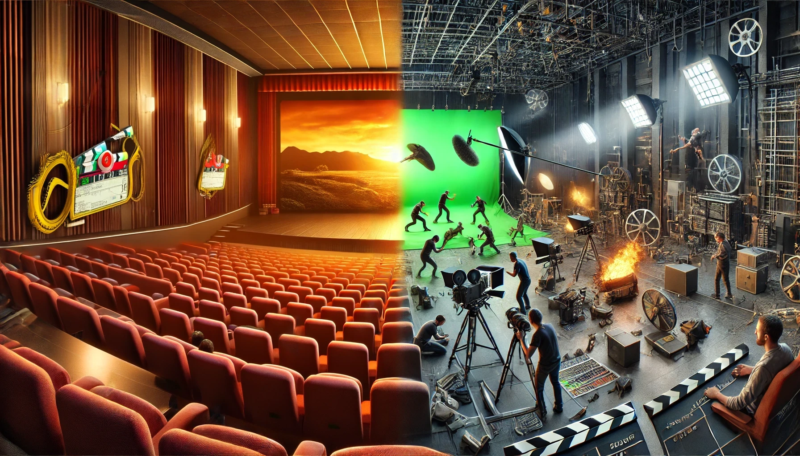

Imagine sitting in a dark theater, completely immersed in a blockbuster movie. The scenes are perfectly shot, the dialogue flows effortlessly, and the special effects make everything feel larger than life. But what you don’t see is the chaos behind the scenes—actors stumbling over lines, green screens replacing entire landscapes, and editors carefully selecting which moments make it into the final cut. The movie you watch is **not reality—it’s a highly curated version of it**. Data works the same way. We treat data as if it’s an objective reflection of the world, but in reality, it’s a **filtered, edited, and often incomplete** version of what actually happens. Just like a movie, **what data includes is just as important as what it leaves out**—and failing to recognize these gaps can lead to flawed decisions.

Yet, despite these edits and omissions, we trust the final cut. We base opinions on it, discuss it as if it’s the full story, and forget that an entire **editing room of choices, cuts, and modifications** shaped what we see. The same is true for data. Leaders, analysts, and decision-makers rely on numbers, charts, and dashboards without questioning **what was removed, altered, or never recorded in the first place**. Just like a director can frame a scene to tell a specific story, **data is framed by what is measured, how it's collected, and what is deemed “relevant.”** When we forget this, we risk treating data as reality itself—making decisions based on an **illusion rather than the full picture.**

This blind trust in data can lead to serious consequences. Organizations make high-stakes decisions—launching products, shifting strategies, or allocating resources—based on numbers that appear precise but may be **missing critical context**. Much like a movie trailer that hypes a film while leaving out the slow, uninteresting parts, data often presents a **tidy, structured version of reality** that conceals its messiness. The problem isn’t just that data is incomplete; it’s that we **rarely stop to ask what’s been left on the cutting room floor.**

This article explores how data, like a movie, goes through a **highly selective editing process** before reaching us. We’ll examine how **data is cleaned, processed, and framed**, much like a film in post-production. We’ll uncover the **deleted scenes—critical information that gets left out**. And we’ll see how **special effects—data manipulation, bias, and selective reporting—can distort reality**. By the end, you’ll understand why data, like a movie, **isn’t reality—it’s a story shaped by choices, limitations, and interpretations.**

### **Act 1: The Editing Room – How Data is a "Final Cut" of Reality**

A raw, unedited film shoot is messy—hours of footage, bloopers, awkward pauses, and scenes that don’t quite work. Before a movie reaches the audience, it undergoes an **extensive editing process** where filmmakers **decide what to keep and what to cut**. Data goes through the same transformation.

At its source, **raw data is chaotic**—filled with noise, errors, and inconsistencies. To make it useful, we process it:\
✅ **Selection:** Choosing what gets measured and what doesn’t.\
✅ **Cleaning & Processing:** Fixing errors, filling in missing values, removing outliers.\
✅ **Aggregation & Simplification:** Summarizing complex data into digestible insights.

Each step **alters the final version of reality that decision-makers see.** What’s removed, adjusted, or summarized shapes the conclusions we draw—just as a movie editor can change a film’s entire tone by deciding which scenes make the cut.

For example, in economic reports, **inflation statistics** might exclude volatile food and energy prices to "smooth out" fluctuations. But for ordinary people struggling with rising grocery bills, **those exclusions make the reported inflation rate feel disconnected from reality.** The data is accurate, but it’s **not the full picture**.

**Key Takeaway:** The data we see isn’t raw truth—it’s a **final cut, edited for clarity, efficiency, and usability**. But like a movie, the editing choices shape the story being told.

### **Act 2: Deleted Scenes – What Data Leaves Out**

Every movie has **deleted scenes**—moments that were filmed but never made it to the final cut. Sometimes they’re removed because they slow down the story, contradict the director’s vision, or just don’t seem important enough. But occasionally, a deleted scene **adds crucial context**, and without it, the story feels incomplete.

Data works the same way. It’s not just about **what is measured**—it’s also about **what isn’t.** The numbers we analyze are only a **fraction of reality**, leaving out **unquantifiable factors, hidden variables, and anomalies that don’t fit the model.**

#### **What Gets Left Out?**

✅ **Human Emotions & Behavior** – Data captures *what* people do, but not *why* they do it.\
🔹 A company might track website clicks and conversions but miss **the frustration of users** struggling with a poorly designed interface.\
🔹 Police departments might measure crime rates but ignore **people who never report incidents** due to fear or distrust.

✅ **Hidden Variables** – Some factors aren’t recorded, which can lead to misleading conclusions.\
🔹 A study might show that **remote workers are less productive**, but if it doesn’t measure **burnout or lack of managerial support**, it tells an incomplete story.\
🔹 A hiring algorithm might prioritize candidates based on experience but **fail to recognize systemic inequalities** that affect resume-building opportunities.

✅ **Small Anomalies** – Outliers often get removed, even if they matter.\
🔹 During the 2008 financial crisis, **early warning signs were dismissed** as statistical anomalies—until the entire system collapsed.\
🔹 In healthcare, rare side effects of a drug might be ignored in trials but become a major issue once the medication reaches millions of people.

#### **The Danger of Ignoring Deleted Scenes**

When we rely on **incomplete data**, we risk making **blind decisions**. It’s like watching a movie with missing scenes—you think you understand the plot, but there are **gaps you don’t even realize exist.**

One striking example is the **failure of early facial recognition AI.** Tech companies trained their models on datasets that were disproportionately **white and male**, excluding diversity as a **"deleted scene"**. The result? These systems **misidentified women and people of color at alarming rates**—leading to wrongful arrests, biased hiring, and flawed medical diagnoses.

**Key Takeaway:** The data we analyze is never the full story. Just because something isn’t measured doesn’t mean it’s irrelevant. Like a deleted scene, **the missing context can change everything.**

### **Act 3: Special Effects – When Data is Manipulated**

Movies rely on **special effects** to create illusions—making the impossible look real. Explosions, de-aging actors, entire cities built with CGI—**what we see on screen is carefully crafted to tell a story, not to reflect reality.** Data can be manipulated in the same way.

While we often think of data as **objective and unbiased**, it can be **distorted, framed, or selectively presented** to create a particular narrative. Whether intentional or accidental, **data manipulation can mislead, overhype, or hide inconvenient truths.**

#### **How Data Gets “Digitally Enhanced”**

✅ **Cherry-Picking – Choosing only the data that fits a narrative**\
🔹 A company releases a press statement saying “Customer satisfaction is up 20%,” but **leaves out** that complaints have also doubled.\
🔹 A study on a new drug focuses only on positive trials while **ignoring failed tests** that would paint a different picture.

✅ **Misleading Data Visualizations – Graphs That Distort Reality**\
🔹 A **truncated Y-axis** (one that doesn’t start at zero) can make small differences look massive—used frequently in politics and business.\
🔹 A **3D pie chart** might exaggerate certain sections, making one category appear larger than it really is.

✅ **Algorithmic Bias – When Data Reflects and Reinforces Inequality**\
🔹 AI hiring tools trained on historical data can **reject candidates from underrepresented groups** because they don't match past hiring trends.\
🔹 Predictive policing models direct officers to **low-income neighborhoods** more frequently, creating a **self-fulfilling prophecy** of crime detection.

#### **The Illusion of “Scientific” Data**

Perhaps the most dangerous manipulation of data is **framing it as pure science.**

In the 1950s, tobacco companies funded research that **downplayed links between smoking and lung cancer.** They didn’t fabricate data—they just **used selective reporting** and cleverly framed studies to create doubt. The numbers were real, but the truth was **hidden in how they were presented.**

The same tactics are used today in areas like:

-   **Tech industry metrics** (Facebook once claimed user engagement was booming, but later admitted to inflating video view counts).

-   **Economic growth statistics** (Governments often change definitions to make job numbers look better).

-   **Social media algorithms** (Platforms claim neutrality, but their data choices **amplify certain narratives** while suppressing others).

#### **Key Takeaway:**

Data, like CGI, can **make something look real even when it isn’t.** Just because a statistic is **plausible and data-backed doesn’t mean it’s truthful.** Before trusting numbers, we need to ask:\
🔹 **What’s been exaggerated?**\
🔹 **What’s been cropped out?**\
🔹 **Who benefits from this framing?**

Like movie special effects, **some data manipulations are harmless storytelling tools—while others are designed to deceive.**

### **Beyond the Screen – Thinking Critically About Data**

Movies are **not reality—they are curated, edited, and enhanced** to tell a particular story. The same is true for data. Every dataset goes through **selection, processing, and framing**, shaping what we see and what we don’t. The danger isn’t just in what data **includes**, but in what it **leaves out, distorts, or exaggerates**.

So, how can we avoid falling for the illusion?

#### **How to Watch Data Like a Critic, Not Just a Viewer**

🎬 **Ask What’s Missing** – Just as deleted scenes change a movie’s meaning, missing data can distort reality.\
🔹 What factors weren’t measured?\
🔹 Are there hidden variables that could change the conclusions?

🎬 **Look for Special Effects** – Be skeptical of **visual tricks, selective reporting, and algorithmic bias.**\
🔹 Are the charts manipulated?\
🔹 Is the data cherry-picked?\
🔹 Who benefits from this framing?

🎬 **Balance Data with Context** – Numbers can guide decisions, but they **aren’t the full story.**\
🔹 Have real-world experiences confirmed the data?\
🔹 Do frontline workers, customers, or experts see a different reality?

🎬 **Recognize That Data is a Scripted Version of Reality**\
Just as movies are shaped by **directors, editors, and studios**, data is shaped by **who collects it, how it's processed, and what story it’s meant to tell**.

#### **Final Thought: Data is a Tool, Not a Truth Machine**

Data is powerful, but it is **never neutral**. Treating it as **absolute reality** is like believing a movie is a documentary—ignoring the edits, effects, and missing pieces that shaped the final version.

**The best decision-makers aren’t just data-driven—they are data-conscious.** They know how to question the numbers, find the missing context, and think beyond the screen.

After all, **would you trust a movie as the full truth? Then why trust data without questioning what’s behind it?** 🎬

### Related Reading

If you want to continue with a closely related topic:

-   [From Data to Wisdom: The Missing Pieces in Data-Driven Thinking](From Data to Wisdom The Missing Pieces in Data-Driven Thinking.qmd)
-   [When Everyone Becomes a Data Expert (And Why That’s a Problem)](2025-02-13 When Everyone Becomes a Data Expert.qmd)
