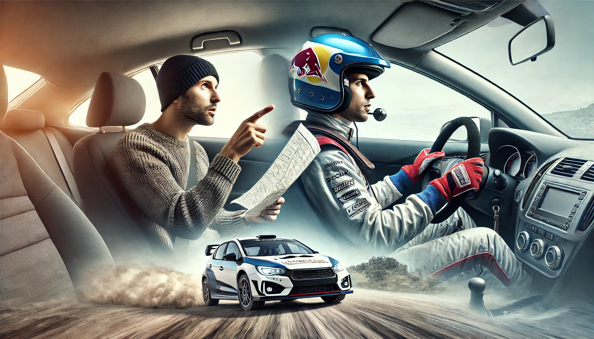

## **Why Everyone Feels Like a Data Expert**

A decade ago, if you wanted insights from data, you needed to **hire a specialist**—a statistician, an analyst, or a data scientist. Today, **everyone has access to dashboards, automated reports, and AI-powered analytics**. This shift has been incredible for **data accessibility**, but it has also created an unintended side effect: **the rise of the overconfident data amateur.**

Much like a backseat driver who has **seen a map once and assumes they can navigate**, many professionals **see a chart, hear a buzzword, or run a basic query** and feel **empowered to make major business decisions.**

### **The Rise of the "Dashboard Decision-Maker"**

Modern business tools have made data **beautifully simple**—but also dangerously misleading.\
✅ **Self-service analytics** platforms like Power BI and Tableau allow anyone to create visual reports.\
✅ **Google Analytics and CRM dashboards** summarize customer behavior in real-time.\
✅ **AI-generated insights** suggest trends and predictions instantly.

This has led to an **illusion of expertise**: If you can **see the numbers**, you must **understand them**—right?

But here’s the problem: **seeing a trend is not the same as understanding it.**

A business executive looking at a **sales dip** on a dashboard might **jump to conclusions**:\
🚩 *“Our marketing strategy isn’t working!”* → (Maybe it’s actually seasonal fluctuation.)\
🚩 *“We need to cut costs!”* → (Maybe supply chain delays are the real issue.)\
🚩 *“This product is failing!”* → (Maybe demand is shifting, not disappearing.)

Without **proper training in statistics, causality, and data bias**, these **misinterpretations lead to bad decisions.**

In fact, entire industries have suffered from **this type of data misinterpretation.**

### **Real-World Example: Google Flu Trends – A Classic Dashboard Mistake**

Back in 2008, **Google Flu Trends (GFT)** was launched with great promise. The idea was simple:

-   Google would analyze **search queries for flu-related symptoms** (like “fever” or “cough”) to estimate flu outbreaks.

-   If a lot of people in a region **Googled flu symptoms**, that area was assumed to have a high flu prevalence.

-   The model seemed **brilliant**—real-time disease tracking without waiting for hospital reports.

At first, **it worked well**. But by 2013, **GFT had massively overestimated flu cases**—by as much as **140% in some regions.** Why?

🚩 The model **confused correlation with causation.** Not everyone searching for “flu” actually had the flu.\
🚩 Media hype and public discussions **spiked searches**, distorting the data.\
🚩 The system **lacked human expertise** to validate findings—Google trusted the numbers blindly.

This is a classic example of **backseat driver data analysis**:

-   The numbers **looked right**, so people trusted them.

-   The deeper **statistical flaws** were ignored.

-   The **illusion of data expertise led to bad decisions**.

This wasn’t a failure of **big data**—it was a failure of **overconfidence in surface-level insights.**

### **When Data Fluency Gets Mistaken for Data Expertise**

There’s a key difference between:

-   **Being fluent in data** (understanding how to use tools, read charts, and track metrics).

-   **Being an expert in data** (knowing how to question, validate, and interpret findings critically).

Many professionals **mistake fluency for expertise**—just like a backseat driver **thinks they understand city navigation** just because they remember a few landmarks.

And this issue isn’t limited to **Google Flu Trends**—it’s everywhere:

🛑 **In Business:** Executives focus on a single KPI (“engagement is down!”) without analyzing **underlying trends** (seasonality, competitor moves, external factors).\
🛑 **In Politics:** Polling numbers are taken at face value **without considering sampling bias** or **question phrasing effects**.\
🛑 **In AI & Automation:** Companies deploy AI systems **without fully understanding how they work**, leading to **biased hiring algorithms, unfair loan approvals, and flawed risk assessments**.

### **The Problem: Overconfidence Leads to Action**

The real danger isn’t just **misinterpreting data**—it’s that **misinterpretations become decisions.**

✅ **Leaders push strategies based on faulty interpretations.**\
✅ **Companies optimize for the wrong metrics.**\
✅ **AI models get built on bad assumptions.**

And once a flawed **“data-driven”** decision is made, it’s **hard to challenge**—because numbers *feel* objective, even when they aren’t.

This is why **backseat driver syndrome in data is more than just an annoyance—it’s a real risk.**

### **Key Takeaway:**

Data democratization is **a great thing**, but it comes with **a responsibility**—**understanding the limits of what you know.** Just as a map reader isn’t a navigator, a **dashboard user isn’t a data scientist**.

## **The Dunning-Kruger Effect in Data – The Overconfidence Problem**

The **Dunning-Kruger Effect** is a well-documented cognitive bias where people with **limited knowledge** overestimate their expertise. In contrast, **true experts**—who understand complexity—tend to be **more cautious** and **aware of their limitations**.

In data, this plays out constantly:\
✅ **Beginners feel confident interpreting charts and trends** without questioning deeper variables.\
✅ **Intermediate users start realizing how much they *don’t* know**—making them hesitant.\
✅ **Experts understand complexity deeply**, making them **less likely to jump to quick conclusions.**

Ironically, **the most dangerous people in data aren’t the uninformed—they’re the slightly informed.**

### **Why Overconfidence in Data Interpretation Is Dangerous**

Many **leaders, marketers, and professionals** suffer from **Dunning-Kruger in data**. They:\
🚩 **Assume correlation = causation** (mistaking a relationship for a cause).\
🚩 **Focus on single metrics** while ignoring confounding factors.\
🚩 **Trust AI and algorithms blindly**, believing them to be “objective.”

This overconfidence creates **serious business, policy, and social risks.**

### **Case Study: The COVID-19 Data Misinterpretation Problem**

The COVID-19 pandemic was a **masterclass in how non-experts misinterpret data.**

🚨 **Example 1: The "High Case Numbers = High Risk" Fallacy**

-   Many people **looked at case numbers in isolation** without considering **testing rates.**

-   Regions that tested **more aggressively** showed **higher cases**, making it *seem* like they were doing worse.

-   In reality, **low-testing regions often had more undetected cases**—but the numbers *looked* better.

🚨 **Example 2: The "Vaccine Doesn’t Work" Misreading**

-   Some people misinterpreted **breakthrough infection rates**, claiming, *“If vaccinated people still get COVID, the vaccine is useless!”*

-   They ignored **the base rate fallacy**—more vaccinated people meant more cases *among* them, but **the risk was still much lower overall**.

These were **classic backseat driver errors**—people saw the dashboard (case charts, vaccine stats) but **didn’t understand the full mechanics of the system.**

### **The "Shallow Knowledge, Big Confidence" Problem in AI & Automation**

Overconfidence in **automated decision-making** is another growing issue.

🤖 **The Myth of AI Objectivity**

-   Many people assume AI models are **“neutral”** because they’re based on data.

-   In reality, **models inherit human biases** from the datasets they’re trained on.

🛑 **Example: AI Hiring Discrimination**

-   **Amazon trained an AI hiring model** using past hiring data.

-   The AI **noticed that most successful past candidates were men** (due to industry bias).

-   It started **downgrading resumes with words linked to women**—reinforcing gender discrimination.

-   **Executives trusted the AI blindly**, assuming “data-driven” meant “fair.”

The **Dunning-Kruger Effect in AI** happens when **leaders trust algorithms they don’t fully understand.**

### **The Real Difference Between Data Users & Data Experts**

The best way to understand **why overconfidence in data is a problem** is to compare:

| **Backseat Data Driver** 🚗 | **Expert Data Navigator** 🗺️ |
|------------------------------------|------------------------------------|
| Sees **correlations** and assumes causation. | Questions **underlying factors** before making conclusions. |
| Focuses on **a single metric** to tell a story. | Considers **multiple sources of evidence**. |
| Believes AI and algorithms are **neutral and objective**. | Knows that **bias exists in all models**. |
| Uses data to **confirm what they already believe**. | Uses data to **challenge assumptions**. |

In short: **Real experts ask more questions before making decisions.**

### **Key Takeaway:**

The **Dunning-Kruger Effect in data is a blind spot** in many industries. **The biggest risk isn’t ignorance—it’s shallow knowledge disguised as expertise.**

## **How to Spot (and Stop) the Backseat Data Driver**

We’ve all encountered a **backseat driver** in data—someone who confidently misinterprets numbers, oversimplifies trends, or pushes flawed conclusions. They’re not acting in bad faith; they just **don’t know what they don’t know**. The problem is that their **misguided confidence can lead to costly mistakes**.

So how do you **spot** a backseat data driver? And more importantly, how do you **prevent overconfidence from damaging decision-making?**

### **🚨 5 Warning Signs of a Backseat Data Driver**

✅ **1. They Prefer Simple Explanations Over Complex Reality**

-   They **reduce everything to a single metric**—“Engagement is down, so we must have bad content.”

-   They **ignore outside factors** like seasonality, competition, or hidden variables.

-   They’re uncomfortable with **uncertainty**, demanding a clear-cut answer.

✅ **2. They See a Chart and Immediately Jump to Conclusions**

-   They trust visuals **without questioning data quality, sampling bias, or methodology.**

-   If they see a downward trend, they assume **something is failing** rather than exploring why.

-   They rarely ask, **“What else could be influencing this?”**

✅ **3. They Confuse Correlation With Causation**

-   If ice cream sales and drowning incidents rise together, they assume **one causes the other** (instead of recognizing that **hot weather drives both**).

-   They believe **if two things happen together, one must be causing the other**—leading to flawed business decisions.

✅ **4. They Trust AI and Data Tools Blindly**

-   They assume AI-generated insights **are always correct** because they come from “the algorithm.”

-   They don’t check **how models were trained** or whether bias exists in the dataset.

-   They take **automated trend forecasts** as **guarantees**, not as probabilistic estimates.

✅ **5. They Use Data to Confirm What They Already Believe**

-   Instead of asking **“What does the data tell us?”**, they ask **“Where can I find data that supports my view?”**

-   They cherry-pick stats **that align with their gut feeling** while ignoring contradictory evidence.

-   Their data “analysis” is **just storytelling with numbers to justify decisions already made.**

🚦 **If you see these signs in a colleague, manager, or even yourself—it’s time to hit the brakes.**

### **🛑 How to Stop the Backseat Data Driver Before They Crash**

The good news? **Overconfidence in data can be corrected.** Here’s how to create a **better data-driven culture** and help backseat drivers become better navigators.

### **🔹 1. Encourage More Questions, Fewer Instant Answers**

-   Train teams to **question numbers before trusting them**.

-   Push for **more “why” and “what else” discussions** instead of accepting **face-value trends**.

-   Make **“What are we missing?”** a regular part of data conversations.

### **🔹 2. Teach the Basics of Statistical Thinking**

-   Not everyone needs to be a data scientist, but teams should understand:\
    ✅ **Sampling bias** (Do these numbers represent the full picture?)\
    ✅ **Statistical significance** (Is this trend real or just noise?)\
    ✅ **Confounding variables** (Could something else be influencing the data?)

### **🔹 3. Separate Data Literacy from Data Expertise**

-   Just because someone **knows how to use a dashboard** doesn’t mean they **understand the complexity behind the numbers**.

-   Train leaders to recognize **when they need expert interpretation** instead of trusting their own assumptions.

### **🔹 4. Foster a Culture Where Uncertainty is Acceptable**

-   Overconfident data misinterpretation happens because people **fear admitting “I don’t know.”**

-   Encourage teams to be **comfortable with uncertainty**—sometimes **the best answer is “We need more data” or “This is inconclusive.”**

### **🔹 5. Never Let Data Drive Alone—Use Context and Expertise**

-   Data should **inform** decisions, not **dictate** them.

-   Combine **quantitative data** with **qualitative insights, real-world experience, and expert opinions** before making big moves.

### **Key Takeaway:**

**The goal isn’t to stop people from using data—it’s to help them use it better.** A great decision-maker isn’t just **data-driven**—they’re **data-aware, context-conscious, and critically thoughtful.**

## **Becoming a Better Data Driver**

Data has become the **steering wheel of modern decision-making**. But as we’ve seen, **not everyone behind the wheel knows how to drive.**

The backseat data driver **isn’t just an executive making overconfident calls**—it’s all of us, at some point. The accessibility of dashboards, AI-driven insights, and real-time metrics **has made data feel easy**, even when it isn’t.

But just like **a GPS doesn’t make someone an expert navigator**, **having data doesn’t automatically make someone a data expert.**

### **The Path to Better Data Thinking**

🚦 **Recognize when you’re in the backseat.**

-   Are you **jumping to conclusions** based on a single chart?

-   Are you assuming **correlation = causation**?

-   Are you **trusting AI-generated insights blindly**?

🛑 **Slow down before making big decisions.**

-   Ask **“What else could explain this trend?”**

-   Look beyond **just the numbers—what’s missing?**

-   Challenge your own biases: **Are you looking for truth or validation?**

🗺️ **Become a true data navigator.**

-   The best data users **aren’t the ones who rush to conclusions**—they’re the ones who **ask the right questions.**

-   They know **when to rely on experts** and when to **look beyond the dashboard.**

### **Final Thought: Data is a Tool, Not an Answer**

Data is **not reality—it’s a simplified model of it.** The best decision-makers don’t **blindly follow the numbers**—they **interpret them carefully, think critically, and never stop asking questions.**

In the end, the best leaders and analysts aren’t just **data-driven**—they’re **data-conscious.**
