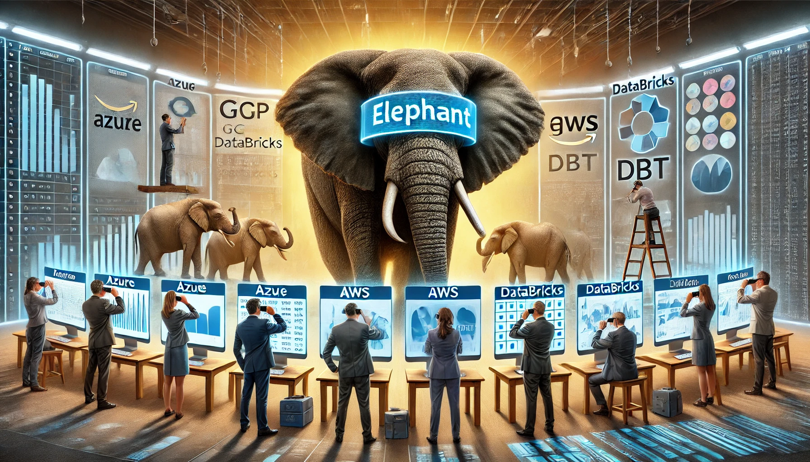

# **The Hidden Influence of Tools**

Most data professionals don’t spend much time thinking about **Marshall McLuhan**—but maybe they should.

McLuhan, a legendary media theorist, famously said, *“The medium is the message.”* His idea? **It’s not just the content that matters—the tool itself shapes how we think, process information, and interact with the world.**

This concept has stuck with me for years—not just because it’s fascinating, but because **I have a PhD in Media and Communication.** While I work with data daily, my background in media theory often gives me an **unexpected advantage**. It helps me **see patterns in how we interact with data tools, how dashboards shape decision-making, and how AI-driven insights subtly influence strategy.**

And the deeper I dive into analytics, the more I realize: **Data professionals are shaped by their tools, often in ways they don’t even notice.**

🔹 **Do you work in Power BI? Then you probably prioritize dashboards and KPIs.**\
🔹 **Are you deep in dbt? You likely think in modular, SQL-driven workflows.**\
🔹 **Are you an AWS-first company? Then your solutions probably default to Redshift and Glue.**

We like to believe we **choose** our tools, but often, **our tools define the way we think.**

This article explores how **cloud data platforms, BI tools, and programming languages shape our decision-making**—not just by what they do, but by **what they encourage, limit, and make invisible.** And more importantly, it will discuss **how to break free from tool bias** and adopt a **more flexible, tool-agnostic mindset.**

# **Act 1: How BI Tools and Dashboards Shape Business Thinking**

Most business leaders believe that dashboards help them **see reality more clearly.** But in reality, **dashboards filter, simplify, and frame data in specific ways**—meaning they don’t just inform decisions, they shape how decisions are made.

Take **Power BI, Tableau, Looker, and Metabase**—all powerful tools, yet each one pushes analysts and executives toward **different ways of thinking**:

✅ **Power BI** enforces a **Microsoft ecosystem mindset**, favoring structured, enterprise-wide reporting.\
✅ **Tableau** emphasizes **visual storytelling**, nudging users toward **interactive, narrative-driven insights**.\
✅ **Looker** forces companies to **predefine metrics** through a modeling layer, influencing how data is explored.\
✅ **Metabase** keeps things lightweight but **limits deeper customization**, which may lead to oversimplified analysis.

Each of these tools subtly **defines what’s easy, what’s difficult, and what’s invisible.**

## **📊 The Hidden Influence of Dashboards**

Dashboards are built to provide **clarity**, but clarity often comes at a cost:

🚦 **They prioritize what’s measurable over what’s meaningful.**

-   If an executive’s dashboard highlights **revenue per user**, they may optimize for short-term profits—even if long-term retention suffers.

-   If “customer engagement” is defined only as **session time**, companies might make features more addictive, not more useful.

🚦 **They make complex realities look simple.**

-   A single KPI going up or down **hides the nuance** of why it’s changing.

-   A red flag on a dashboard triggers **panic**, even when a small fluctuation is natural.

🚦 **They discourage deep exploration.**

-   Decision-makers **rely on what’s visible**, even if the real insights lie in **deeper queries, unstructured data, or qualitative feedback.**

## **🚨 Case Study: When the Dashboard Becomes the Strategy**

A global e-commerce company wanted to **improve customer satisfaction.** Their leadership team, relying on a **highly visual BI dashboard**, focused on a single KPI: **Net Promoter Score (NPS).**

To push NPS higher, they:\
✅ Simplified survey questions.\
✅ Added incentives for good ratings.\
✅ Encouraged customer service reps to **“nudge” users toward positive feedback.**

The result? **NPS improved, but actual customer satisfaction declined.**

Why? Because **the dashboard framed NPS as the goal, rather than actual customer experience.** The metric **became the mission**—leading to short-term optimizations that didn’t reflect true loyalty or satisfaction.

This is the **danger of dashboard-driven thinking**: When tools define success, companies **optimize for the number, not for reality.**

## **🔹 Tool-Agnostic Approach: Thinking Beyond Dashboards**

✅ **Ask: What’s missing?** A dashboard shows **selected** data—what insights exist outside of it?\
✅ **Validate KPIs with deeper analysis.** If retention is high but NPS is low, **look at user feedback, qualitative insights, and unstructured data.**\
✅ **Use dashboards as a starting point, not the whole story.** Sometimes, **writing SQL, using Python, or digging into raw logs** reveals what dashboards don’t show.

**Final Thought:** BI tools don’t just help us analyze data—they define **what’s important and what isn’t.** If we don’t question them, we **let them shape our thinking without realizing it.**

# **Act 2: How Cloud Data Platforms Shape the Way We Work with Data**

Cloud data platforms—whether **Azure, AWS, GCP, Databricks, Snowflake, or dbt**—don’t just store and process data. They **define how data is structured, how teams interact with it, and even what types of insights are possible.**

Just like **BI tools frame how we interpret data**, cloud platforms shape **how we collect, transform, and analyze it.**

## **☁️ How Different Cloud Platforms Influence Data Thinking**

Each cloud ecosystem has its **own philosophy**, which pushes users toward **certain methods of working with data**:

✅ **Azure Synapse vs. Snowflake vs. BigQuery – The War of Warehouses**

-   **Azure Synapse** integrates deeply with Microsoft products, leading enterprises toward **structured, SQL-heavy analytics.**

-   **BigQuery** promotes a **serverless, pay-as-you-query** approach, influencing companies to optimize for **cost-efficiency over unlimited querying.**

-   **Snowflake** separates **compute from storage**, pushing engineers to **design scalable architectures differently.**

✅ **Databricks vs. dbt – ELT vs. Lakehouse Thinking**

-   **Databricks** prioritizes **big data & AI workflows**, encouraging teams to think in **data lakehouse architectures.**

-   **dbt** enforces **a modular, SQL-first analytics engineering mindset,** making transformation work structured and version-controlled.

Each platform makes **certain tasks easier while making others harder.** A **dbt-first team** may naturally lean toward **SQL-based transformation**, even when a Python model might work better. A **Databricks-first team** may over-prioritize AI pipelines, even when a simpler dashboard would suffice.

**What happens when the tool defines the approach, rather than the problem defining the tool?**

## **📊 Cloud-Driven Bias: The Tools We Pick Shape the Insights We Get**

🔹 **A company built entirely on AWS is more likely to optimize for Redshift, Glue, and Athena—even if a different tool would be better.**\
🔹 **An Azure-heavy enterprise naturally leans into Power BI and Synapse, reinforcing Microsoft-native analytics.**\
🔹 **A Databricks-first team may over-prioritize ML workflows, even when a simple SQL report would solve the problem.**

**The result? Companies don’t always pick the *best* tool—they pick what fits their existing cloud provider.**

This creates **unintentional tool bias**:\
🚩 Teams **avoid better alternatives** just because they require a different cloud setup.\
🚩 They design data models **to fit the platform’s strengths**, even when a different approach might work better.\
🚩 They lock themselves into **a cloud-native way of thinking**, limiting flexibility.

## **🚨 Case Study: When Cloud Lock-In Changes How Data Teams Think**

A fast-growing tech startup initially built its analytics stack on **Google Cloud (GCP)**, using **BigQuery and Looker** for reporting. As they scaled, their engineers realized:

✅ They needed **real-time analytics**, but **BigQuery’s batch processing made this difficult.**\
✅ Looker’s pre-modeled data layer **didn’t support ad-hoc machine learning pipelines.**\
✅ A **streaming-first approach** (like **Kafka & Databricks**) would have been better—but migrating was costly.

Instead of switching, the company **kept forcing their use case into GCP’s ecosystem**—patching workflows, adding complexity, and making **trade-offs that wouldn’t have existed on another platform.**

The takeaway? **Cloud platforms don’t just shape infrastructure—they shape how teams think, structure data, and even define success.**

## **🔹 Tool-Agnostic Approach: Avoiding Cloud-Driven Blind Spots**

✅ **Pick tools based on the problem, not the provider.** Just because you’re on AWS doesn’t mean **Redshift is the best choice**.\
✅ **Cross-train engineers on multiple ecosystems.** A Snowflake-trained team **should still explore alternatives** like BigQuery or DuckDB.\
✅ **Prioritize interoperability.** Multi-cloud and open-source solutions help avoid **long-term lock-in.**

**Final Thought:** Just as BI tools define **what insights are visible**, cloud platforms define **how data is structured, processed, and interpreted.** If we don’t challenge their influence, we let them **limit our options without even realizing it.**

# **Act 3: How Scripting Languages Shape the Analyst’s Mindset**

Just like **BI tools frame business thinking** and **cloud platforms shape data workflows**, **the programming languages we use define how we approach problem-solving.**

A SQL expert, a Python data scientist, and an R statistician might analyze **the same dataset**—but their conclusions could be completely different.

Why? Because **each language trains the mind differently**, encouraging distinct ways of thinking, structuring data, and solving problems.

## **💻 How Different Languages Shape Data Thinking**

🔹 **SQL – The Relational Thinker**\
✅ Trains analysts to think in **structured, set-based logic**.\
✅ Encourages breaking problems into **aggregations, joins, and filtering.**\
✅ Best for **querying and reporting,** but lacks flexibility for deeper analytics.\
🚩 **Risk:** Can lead to **rigid, table-only thinking**, making it harder to embrace machine learning or non-relational approaches.

🔹 **Python – The Model-Driven Scientist**\
✅ Encourages a **procedural, experimentation-first approach**.\
✅ Used for **automation, AI, machine learning, and advanced analytics**.\
✅ Great for handling **unstructured data** and complex workflows.\
🚩 **Risk:** Can lead to **over-engineering** solutions when a simple SQL query would work.

🔹 **R – The Statistical Purist**\
✅ Built for **academic, statistical, and hypothesis-driven analysis**.\
✅ Preferred by researchers for **time series, Bayesian analysis, and econometrics**.\
✅ Powerful for **data visualization and exploratory data analysis (EDA)**.\
🚩 **Risk:** Can be **too specialized** for business applications, making it harder to productionize models at scale.

Each language makes **certain types of questions easier and others harder.** A **SQL-first analyst** might struggle with machine learning, while a **Python-first data scientist** may overlook simple SQL solutions.

## **🚦 When the Language Becomes the Limitation**

A **data team’s primary language often becomes its default solution—even when it’s not the best fit.**

🔹 A **finance team trained in SQL** might **force everything into table structures**, even when **graph databases or ML models would be better.**\
🔹 A **Python-heavy data science team** might build **custom ML solutions** when a **BI tool would have sufficed.**\
🔹 A **statistical research team using R** may struggle to **transition models into production environments.**

🚨 **Example: The SQL-Only Trap in Data Engineering**\
A company with a strong **SQL-first engineering team** was struggling to **integrate real-time data processing**. Their instinct? **Try to solve it with more SQL.**

Instead of adopting **event-driven architectures** or **Python-based ETL pipelines**, they:\
🚩 Overcomplicated their queries with **scheduled batch jobs.**\
🚩 Used **inefficient workarounds** instead of embracing **a more flexible approach.**\
🚩 Wasted months optimizing SQL queries instead of **using a tool designed for real-time data.**

The result? **A rigid, inefficient system built around their existing skill set, not the actual problem.**

## **🔹 Tool-Agnostic Approach: Learning the Right Language for the Right Job**

✅ **Encourage multi-language literacy.** Great analysts don’t just use SQL or Python—they **know when to switch.**\
✅ **Pick languages based on the problem, not familiarity.** If real-time analytics is needed, **SQL alone isn’t enough.**\
✅ **Promote cross-functional learning.** Data engineers, analysts, and scientists should **collaborate and share knowledge** across tools.

**Final Thought:** The best data teams **aren’t just SQL-first, Python-first, or R-first—they’re problem-first.** The language should serve the analysis, not define it.

# **Choosing Tools Consciously, Not Just Conveniently**

Marshall McLuhan was right: **“The medium is the message.”** In data, that means **the tools we use don’t just help us analyze information—they shape what we see, how we think, and what we prioritize.**

Most people assume they **control their data tools**, but in reality, the tools often control them.\
✅ **BI dashboards dictate which KPIs get attention.**\
✅ **Cloud platforms nudge teams toward vendor-specific workflows.**\
✅ **Scripting languages define how analysts frame problems.**

If we **don’t question these influences**, we risk making **decisions shaped by tool constraints rather than actual business needs.**

## **🚀 How to Break Free from Tool-Driven Thinking**

🔹 **Recognize when a tool is shaping your thought process.**

-   Are you **choosing** metrics, or just following what the dashboard shows?

-   Are you **using SQL because it’s best**, or because it’s **the easiest option for your team**?

-   Is your cloud provider dictating **what’s possible** instead of **what’s ideal**?

🔹 **Adopt a tool-agnostic mindset.**

-   Just because you work in **AWS doesn’t mean Redshift is always the best fit.**

-   If you only use SQL, consider **learning Python or R** to expand your problem-solving toolkit.

-   If your dashboard highlights engagement metrics, **ask what’s missing.**

🔹 **Make technology choices based on the problem, not convenience.**

-   If a machine learning model needs real-time data, don’t **force a batch SQL process just because it’s familiar.**

-   If customer retention matters more than click-through rates, **don’t let the dashboard dictate your focus.**

-   If a KPI looks good, **ask whether it truly represents success—or just what’s easy to measure.**

## **Final Thought: Great Analysts Think Beyond the Tool**

The best decision-makers aren’t just **data-driven**—they’re **data-conscious.** They don’t just use tools—they **question how those tools shape their thinking.**

🚦 Next time you analyze data, ask yourself:\
*Am I making this decision, or is my tool making it for me?*
