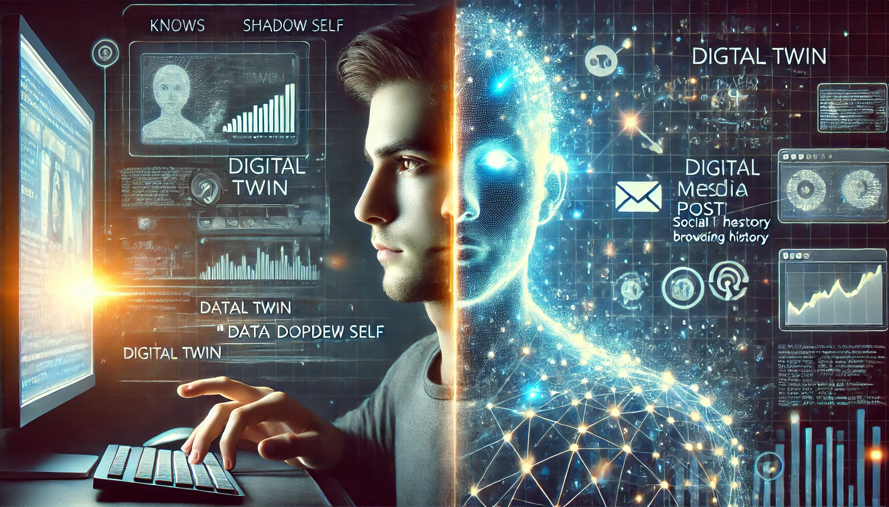

## **The You That Exists Online**

If you disappeared tomorrow, how much of you would still be here?

No, not in the philosophical sense—**but in the data-driven, algorithmically defined version of you that already exists online.**

Every Google search, every Netflix choice, every tap on your phone **contributes to an invisible, evolving entity that mirrors your behaviors, preferences, and even personality.** This isn’t just a digital footprint—it’s something much bigger.

You may not realize it, but you have a **data doppelgänger**.

Companies, algorithms, and AI systems **are constantly building a virtual version of you**—one that predicts what you’ll buy, what you’ll click on, what news you’ll believe, and even what decisions you’ll make. It knows you **not just as you are today, but as you’ll be tomorrow.** And the more you interact with technology, the **more detailed and independent it becomes.**

This article explores how **our data doppelgängers are created, how they influence our lives, and whether they might outlive us.** More importantly, it asks: **Are we still in control of our digital selves—or are they controlling us?**

## **Act 1: The Creation—How Your Digital Doppelgänger is Built**

Your digital doppelgänger didn’t appear overnight. It wasn’t created by a single action, like signing up for Facebook or making an online purchase. Instead, it has been **assembled piece by piece**, quietly constructed from countless data points—most of which you never even realized you were giving away.

#### **📌 The Obvious Pieces: What You Know You’re Sharing**

Some data traces are easy to understand. You know that:\
✅ **Google tracks your searches** to improve results (and show better ads).\
✅ **Netflix remembers what you watch** to recommend more shows.\
✅ **Amazon logs your purchases** to suggest products you “might like.”

These feel like fair exchanges—**you give data, you get convenience.** But this is only **the surface layer** of your digital twin.

#### **🔍 The Hidden Pieces: What You Don’t Realize You’re Sharing**

Even when you’re **not actively posting, searching, or buying,** your devices are still collecting and interpreting your behavior:

-   **How fast you type** (your keystroke patterns are unique).

-   **How long you pause before clicking** (indicates hesitation or confidence).

-   **Your scrolling habits** (AI knows when you skim vs. when you engage).

-   **Your device movements** (yes, your phone accelerometer can detect if you’re walking, driving, or lying down).

None of these things, on their own, mean much. But when combined? **They create an incredibly detailed profile of how you think, feel, and act.**

#### **🤖 Predicting You Before You Act**

Once enough data has been collected, your digital twin stops just **reflecting you**—it starts **predicting you.**

Ever noticed how Spotify recommends **the perfect song for your mood**, even when you didn’t realize what you wanted to hear? That’s because AI doesn’t just track **what you like**, it **analyzes when and why you like it.**

🔹 **Google can guess what you’ll search before you type it.**\
🔹 **TikTok knows what videos you’ll watch next—sometimes before you do.**\
🔹 **Retailers adjust prices dynamically based on your past buying habits.**

Your digital doppelgänger **isn’t static—it evolves with every click, swipe, and hesitation.**

#### **Key Takeaway:**

Your digital twin isn’t just **a collection of past actions**—it’s **a living model of your future self.** And it’s getting smarter every day.

## **Act 2: The Doppelgänger at Work—How Companies Use Your Digital Shadow**

Your data doppelgänger isn’t just sitting in a database somewhere, collecting dust. It’s **actively working behind the scenes**, influencing decisions that affect your daily life—often without you even noticing.

#### **🎯 The Personalization Illusion: Are You Choosing, or Being Chosen?**

When you open Netflix, Spotify, or an online store, it feels like **you’re making the choices.** But in reality, your digital twin has already **pre-filtered your options**:\
✅ The movies you see first? **AI knows what you’ll likely watch based on past behavior.**\
✅ The products that appear on top? **Amazon’s ranking algorithm has already decided what “best” means for you.**\
✅ The ads in your feed? **Your digital twin predicted which ones would catch your attention.**

At first glance, this sounds helpful. Who wouldn’t want a **more personalized, frictionless experience?** But here’s the catch: **Personalization isn’t always about serving *your* interests—it’s about optimizing engagement.**

📌 **Example:** TikTok’s algorithm **figures out your interests in minutes**, keeping you hooked by **feeding content that triggers emotional reactions.** But does that mean **it’s showing you what’s best for you—or just what will keep you scrolling?**

#### **🛑 The Hidden Consequences of Your Data Twin**

🔹 **Pricing Discrimination:** Your doppelgänger helps **businesses set dynamic prices just for you.**

-   Airlines, hotels, and e-commerce sites **adjust prices based on your past behavior.**

-   Someone who shops for luxury brands **may see higher prices** than someone flagged as budget-conscious.

🔹 **Credit & Hiring Decisions:** AI-driven background checks **use data doppelgängers to assess risks.**

-   Loan approval systems **analyze your digital footprint**, even if you’ve never applied before.

-   AI-powered hiring tools **reject candidates based on “behavioral markers”**—sometimes without them even realizing it.

📌 **Example:** A 2020 study found that some **AI-driven hiring tools rejected applicants** based on factors like **typing speed and browsing habits**—assuming they correlated with job performance.

🔹 **News & Information Filtering:** Your doppelgänger **influences what you believe.**

-   Social media platforms **prioritize posts that reinforce your past behaviors**, pushing you into **algorithmic bubbles**.

-   Search engines **adjust rankings based on what they think you want to see**, rather than what’s most objective.

📌 **Example:** Google personalizes search results **so two people searching the same phrase may see completely different information.**

#### **🧩 The Bigger Picture: Is Your Digital Doppelgänger Helping or Trapping You?**

Your data twin **isn’t just a reflection of your past—it shapes your future.** It determines:

-   🔹 What **job opportunities** you see.

-   🔹 What **products and prices** you’re offered.

-   🔹 What **information you consume.**

In many ways, **your digital self is making choices on your behalf.** The question is: **Are they the right ones?**

## **Act 3: The Future—Can Your Digital Doppelgänger Outlive You?**

Your data doppelgänger is already shaping your present—but what happens **when it keeps existing, even after you’re gone?**

It may sound like sci-fi, but **AI-driven models already allow digital copies of people to “live on” after death.** The more data you feed into the system, the more realistic your **digital twin becomes—and the harder it is to erase.**

#### **👻 The Rise of AI “Ghosts”**

🔹 **Chatbots trained on personal data**

-   In 2021, a software engineer recreated a chatbot of a deceased loved one using past texts and conversations.

-   Microsoft has patented an idea for **an AI chatbot modeled after real people**—even deceased individuals.

🔹 **Posthumous social media presence**

-   Meta allows accounts to be “memorialized,” keeping a digital version of a person active indefinitely.

-   Some AI tools can **generate new content “in the voice” of a deceased user**, using past posts as training data.

🔹 **Deepfake resurrection**

-   Advances in **voice and video synthesis** make it possible to **recreate** a person’s likeness.

-   Ethical dilemmas arise: **Who controls your digital identity after you die?**

📌 **Example:** In 2020, AI was used to **bring Salvador Dalí “back to life”** in an interactive museum exhibit—generating new speech and movements based on past data.

#### **🛑 The Ethical Dilemmas of Digital Immortality**

Your **data doppelgänger doesn’t die when you do**—it just stops receiving new inputs. But companies may still use it to:\
🔹 **Sell posthumous services** (AI-generated messages, interactive memories).\
🔹 **Train future AI models** without consent.\
🔹 **Influence the way you’re remembered.**

Who owns **your digital twin** after you’re gone? Should people be able to **delete their AI-generated selves?**

#### **🔹 Can We Ever Reclaim Our Digital Selves?**

As our online identities become **more advanced, more persistent, and more valuable**, the question isn’t just **who we are today**, but:

-   **Who controls our digital identity in the future?**

-   **Can we ever erase our data doppelgänger—or will it continue evolving, even after us?**

Right now, we don’t fully know the answers. But one thing is clear:\
🔹 The **more we engage with technology, the more detailed our digital selves become.**\
🔹 And the more detailed they become, the **less control we have over them.**

## **Conclusion: Can You Ever Reclaim Yourself?**

Your **data doppelgänger is not a static reflection**—it’s a growing, evolving entity, shaped by every click, search, and interaction. It influences **what you see, what you buy, and even what you believe.** And as AI advances, it may **outlive you, act on your behalf, and exist in ways you never intended.**

So, can you ever truly **erase it?**

The truth is, **full digital erasure is nearly impossible.**

-   **Deleting your social media accounts** doesn’t erase the **data already collected.**

-   **Using incognito mode** stops your browser from saving history—but doesn’t prevent websites from tracking behavior.

-   Even if you stop using technology today, **your past actions remain in datasets, AI models, and corporate archives.**

#### **🚀 The Path Forward: How to Take Back Control**

🔹 **Be aware of what data you’re sharing.**

-   Think beyond cookies—consider the **patterns** AI is learning about you.

🔹 **Challenge how your digital twin is used.**

-   Do AI-driven recommendations **serve you, or just optimize engagement?**

-   Are hiring and credit systems **judging you based on factors you can’t see?**

🔹 **Push for ethical AI and digital rights.**

-   Should we have the right to **own, delete, or transfer our digital selves?**

-   If companies profit from your data, **should you have control over it?**

Right now, **our digital doppelgängers exist in a gray area**—powerful, persistent, but largely unregulated. The question is no longer **whether they exist,** but **how much control we have over them.**

And if we don’t take control now, **who—or what—will?**
