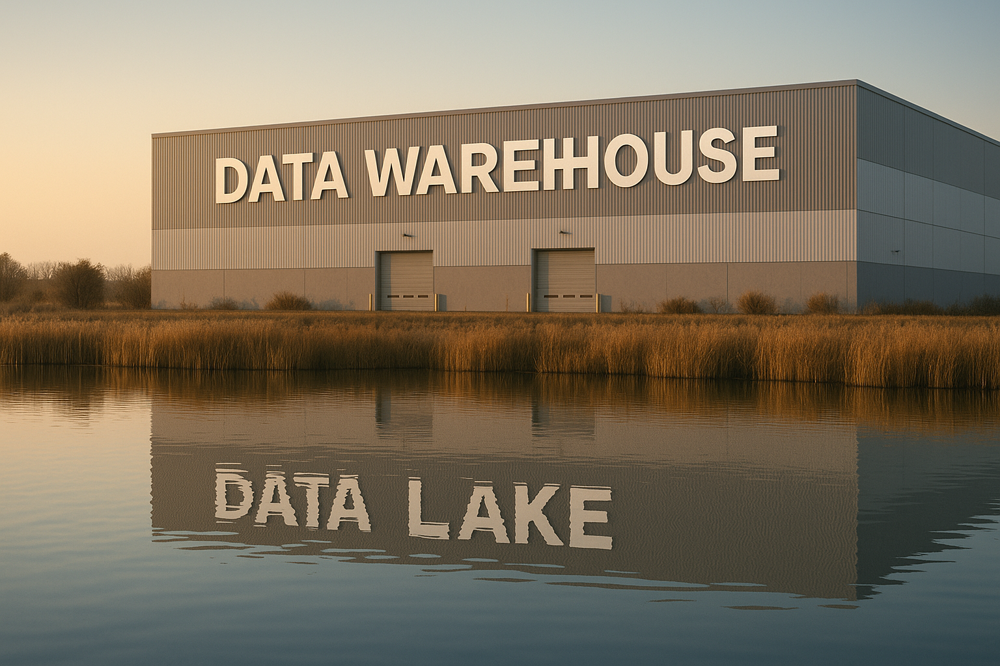

### **Why the “Where” of Data Matters Now More Than Ever**

Not long ago, storing data was simple.\
You had a **database**. It had tables. You queried them. You moved on with your life.

Fast forward a few years and suddenly everyone’s throwing around words like **data lakehouse**, **semantic layer**, and **federated query engine**, as if we’re all running our own cloud-native Amazon fulfillment center.

Which, in a way… we kind of are.

Today’s data stack is less like a tidy file cabinet and more like a complex warehouse ecosystem—**forklifts, conveyor belts, smart shelves, and mystery boxes all included.** And just like in the real world, you’ve got:

-   Raw materials dumped in one corner

-   Carefully packaged goods ready for shipping

-   Staff arguing over where the metrics live

-   And some new system that promises to fix everything (but adds six new acronyms)

This article is your **warehouse tour of the modern data world**. We’ll walk through the major storage architectures—from classic relational databases to lakehouses and data fabrics—**without getting stuck in buzzwords** or buried in vendor slides.

You don’t need to memorize everything. You just need to know **what’s real, what’s useful, and what’s mostly marketing**.

So grab your clipboard—we’re about to untangle the data stack.

### **The Building Blocks – From Databases to Warehouses**

Let’s start with the basics—the solid foundation every data operation (and warehouse tour) begins with: **where we first learned to store and retrieve stuff without losing our minds.**

#### **📁 Relational Databases (RDBMS) – The Filing Cabinet in the Back Office**

Before there were lakes and fabrics and houses made of data, there was… **SQL.**\
Relational databases like **PostgreSQL, MySQL, Oracle** were designed to store structured data with integrity, enforce relationships between tables, and keep everything neatly typed and indexed.

**Think of it like this:**\
You’re running a small business. You’ve got a sturdy filing cabinet with labeled folders: one for customers, one for orders, one for inventory. Need to know who ordered product #123? Flip open the "Orders" folder and match the Customer ID. Efficient. Familiar. Reliable.

💡 Great for:

-   Transactional systems (CRMs, ERPs)

-   Smaller analytics workloads

-   Anything that benefits from strong consistency and tight schema

⚠️ Not great for:

-   Huge volumes of data

-   Complex, cross-department analytics

-   Your ten-person startup suddenly behaving like a 200-terabyte e-commerce giant

#### **🏢 Data Warehouses – The Professional Logistics Center**

Now imagine you’ve outgrown that filing cabinet. You need forklifts, barcode scanners, inventory reports. Welcome to the **data warehouse**—the optimized, industrial-strength version of storage, built for analysis.

With platforms like **Snowflake, Redshift, BigQuery**, data warehouses don’t just store data—they **prepackage it for fast, structured querying.**\
They’re designed for **read-heavy workloads** and performance at scale.

**Metaphor mode on:**\
This is the part of the warehouse with rows of perfectly stacked pallets, labels in four languages, and a dashboard showing inventory turnover rates by region. Everyone from BI to Finance to Marketing has their own scanner and knows how to use it.

💡 Great for:

-   Dashboards and reports

-   SQL-based analytics

-   Teams who need **clean, curated, high-performance data**

⚠️ Not perfect for:

-   Storing raw, unstructured data

-   Onboarding new sources quickly

-   Running ML experiments with messy inputs

Next up, we’ll roll into the **chaotic, unstructured frontier of data lakes and the lakehouse revolution**—where things start getting cheaper, faster… and messier.

### **The Explosion – Lakes, Lakehouses, and Federated Access**

Once your data warehouse is running smoothly, someone inevitably says,

> “Hey, can we also store the clickstream logs, IoT sensor data, call transcripts, and PDFs of hand-written receipts?”

Enter the **data lake.**

#### **🌊 Data Lakes – The Overflow Lot Out Back**

A data lake is what happens when you say, “Yes, let’s save everything—we’ll figure it out later.”\
It’s built on object storage like **Amazon S3 or Azure Blob**, and it happily accepts **structured, semi-structured, and unstructured data**—without much complaint or structure.

**Imagine this:**\
Behind your tidy warehouse is a huge open yard where delivery trucks just dump their contents. No labels. No sorting. Somewhere in there is the thing you need… if you can find it.

💡 Great for:

-   Collecting raw data from diverse sources

-   Storing logs, images, clickstream data, etc.

-   Data science workflows where exploration is key

⚠️ Watch out for:

-   Becoming a “data swamp” if nothing is documented

-   Slow querying if you don’t layer on additional tools

-   Analysts quietly weeping as they try to find the right JSON blob

#### **🏡 Lakehouses – A Fancy New Warehouse Built on the Old Lake**

The lakehouse is the **data world’s answer to “what if we combined the flexibility of lakes with the structure of warehouses?”**\
It’s not a single tool, but an **architecture pattern**—powered by tools like **Databricks, Apache Iceberg, and Delta Lake**.

**Picture this:**\
You’ve paved the yard out back. Installed automated shelving. Maybe even built some walls. It’s still got all the messy data—but now you can run SQL on it, define tables, and pretend it’s a real warehouse.

💡 Great for:

-   Teams that want **low storage costs and high analytical power**

-   ML engineers and analysts working on the same platform

-   Streaming and batch data coexistence

⚠️ Downsides:

-   Can be complex to implement well

-   Governance and performance tuning still require attention

-   It’s still under construction in many orgs

#### **🔀 Federated Query Systems – The “See Everything” Dashboard**

Don’t want to move the data at all? Just want to **query across lakes, warehouses, and databases** like it’s all in one place?

That’s what tools like **Trino, Starburst, and Presto** offer: the ability to **query anything from anywhere**—without copying it first.

**Warehouse metaphor:**\
You’re in a control room with a touchscreen map. You can ping any shelf in any location—“How many left-handed widgets do we have across all regions?”—and the system fetches it.

💡 Great for:

-   Cross-platform analytics

-   Avoiding duplication

-   Analysts who like freedom

⚠️ Realities:

-   Performance can vary widely

-   Governance gets complex fast

-   Still doesn’t clean your data for you 😅

Up next: **the specialized, people-driven layers**—datamarts, mesh, and the mysterious world of data fabrics.

### **Specialized Layers – Datamarts, Mesh, and Fabrics**

By now, your data warehouse is humming, your lakehouse is up and running, and your federation engine has probably earned a sarcastic nickname. But you’re still hearing things like:

> “Can we get a view just for Finance?”\
> “What if each team owned their own metrics?”\
> “How do we tie all this together across cloud providers?”

Welcome to the **layered layer** of modern data architecture—where structure meets strategy.

#### **🏬 Datamarts – The Stockroom for Specific Teams**

Think of a **datamart** as a boutique version of your warehouse—**smaller, more focused, team-specific.**\
Instead of asking everyone to query the full warehouse, you carve out a **clean, curated view just for one department**: marketing, finance, ops.

**In warehouse terms:**\
It’s like giving each department their own loading dock, stocked with only what they care about. Finance doesn’t need every user click. They just want the monthly revenue by region.

💡 Great for:

-   Tailoring data to specific domains

-   Reducing query complexity for non-technical users

-   Speeding up dashboard performance

⚠️ Downsides:

-   Can drift from source-of-truth metrics if not managed well

-   Risk of siloed definitions (“why is *our* revenue different from *their* revenue?”)

#### **🕸️ Data Mesh – Warehouses Run by Teams, Not Central IT**

**Data mesh** isn’t a tool—it’s a philosophy. It flips the script:\
Instead of one central team owning all pipelines and definitions, **each domain team owns their own data products.**

**Imagine this:**\
Instead of a single Amazon-style megawarehouse, you have a **network of smaller warehouses**, each run by a different team. They’re responsible for their own stock quality, shelf labeling, and restocking schedules.

💡 Great for:

-   Scaling data responsibilities across large orgs

-   Aligning data ownership with domain expertise

-   Empowering teams to move faster without waiting for central bottlenecks

⚠️ Realities:

-   Coordination overhead

-   Cultural change required

-   Data consistency can suffer without governance standards

#### **🧶 Data Fabric – Metadata Meets Middleware**

**Data fabric** is the **knit sweater** of your architecture—it wraps around all your systems, tying them together with **metadata, governance, and discovery layers**.

It’s the “smart glue” that helps answer:

-   Where does this data live?

-   Who owns it?

-   Is it up to date?

-   Can I trust it?

**Warehouse analogy:**\
It’s the centralized tracking system that tells you what’s in every warehouse, who stocked it, when it was last updated, and whether it’s safe to use.

💡 Great for:

-   Large, complex, multi-cloud environments

-   Data governance, lineage, and observability

-   Helping users find and trust data across sources

⚠️ But be warned:

-   Often more **buzzword than reality**

-   Heavy vendor-driven narrative

-   Works best when built gradually, not bought wholesale

### **The Invisible Layers – What Supports the Stack**

So far, we’ve toured the flashy parts of the warehouse—structured shelves, smart sorting systems, department-specific corners. But as any good logistics nerd will tell you, it’s what’s behind the scenes that **really makes it all work**.

These are the **invisible but essential layers**: storage formats, streaming pipes, and the quiet heroes who make sure your “monthly revenue” KPI means the same thing in Tableau as it does in Python.

#### **💾 Object Stores – The Digital Concrete Floor**

Behind every data lake and lakehouse is an **object store**—cheap, durable, infinitely scalable.\
Amazon S3, Google Cloud Storage, Azure Blob—**these are where your raw files live**, whether they’re JSON logs or CSVs from that one legacy vendor who still uses semicolons.

**Metaphor time:**\
Think of object storage as the **concrete floor of your warehouse**. It’s not fancy, but without it, everything else collapses.

💡 Great for:

-   Low-cost data storage

-   Decoupling storage from compute

-   Feeding multiple downstream systems

#### **📦 Columnar Formats – Pallets for Data**

If object stores are the floor, **columnar formats** like **Parquet, ORC**, or even **DuckDB** are the way we **pack the boxes.**

Instead of reading every row to get a column (like a CSV), these formats let you **grab just the data you need—faster, lighter, and cheaper.**

**In warehouse terms:**\
They’re the **well-stacked pallets** that make loading and unloading smooth.

💡 Great for:

-   Analytical workloads

-   Storage efficiency

-   Making query engines happy

#### **🧠 Semantic Layers – The Labels on Every Box**

You’ve got the data. You’ve got the warehouse.\
Now the real question: **What does “revenue” actually mean?**

That’s where **semantic layers** come in. Tools like **LookML, dbt metrics, Cube.js** help define and maintain **shared business logic**, so everyone calculates things the same way.

**Warehouse vibe:**\
The semantic layer is the **labeling system** that ensures “Widget X” in the finance report is the same “Widget X” that ops is tracking in their dashboard.

💡 Great for:

-   Ensuring consistency across teams and tools

-   Centralizing definitions without centralizing data

-   Aligning KPIs with the business

#### **🚚 Streaming Platforms – The Conveyor Belts**

Sometimes data doesn’t sit—it moves.\
**Streaming platforms** like **Kafka or Kinesis** bring data in **real time**, enabling event-driven architectures, instant dashboards, and fast model retraining.

**Analogy mode:**\
It’s the **conveyor belt** that keeps goods flowing continuously through your warehouse. No rest, no waiting.

💡 Great for:

-   Real-time analytics

-   Event tracking

-   ML pipelines that need freshness

⚠️ But beware:

-   Requires thoughtful engineering

-   Harder to debug

-   Not always necessary (batch still works for a lot)

With these invisible layers humming quietly under the surface, your data stack starts to look less like a pile of disconnected buzzwords—and more like a well-run operation.

### **You Don’t Need Everything—Just the Right Combination**

If you’ve made it this far, congratulations—you now speak fluent warehouse.

You’ve walked through the back-office filing cabinets (relational databases), the buzzing logistics centers (data warehouses), the muddy but massive overflow yards (data lakes), and the elegant-but-still-under-construction lakehouses. You’ve met teams that run their own warehouses (data mesh), tracked shipments across regions (federation), and labeled every box for reuse (semantic layers).

And here’s the big takeaway:\
**You don’t need the entire stack. You need the right stack—for your team, your goals, and your stage.**

💡 A startup might thrive on a single warehouse and a few curated dashboards.\
🏢 A scaled enterprise might need a lakehouse, a data fabric, streaming ingestion, and a semantic layer to survive Monday.

But throwing tools at your architecture doesn’t guarantee clarity. In fact, **complexity is cheap—coherence is hard.**

So as you explore tools, platforms, and philosophies, keep this in mind:

-   Don’t chase hype.

-   Don’t overbuild.

-   **Build something your team understands and can grow into—not just something that impresses vendors.**

In the end, modern data architecture isn’t about having everything. It’s about **knowing what you need, using it well, and helping others find their way through it.**

And if you ever feel lost in the stack again?\
Just look for the labels. Or the person who took the time to write some.
