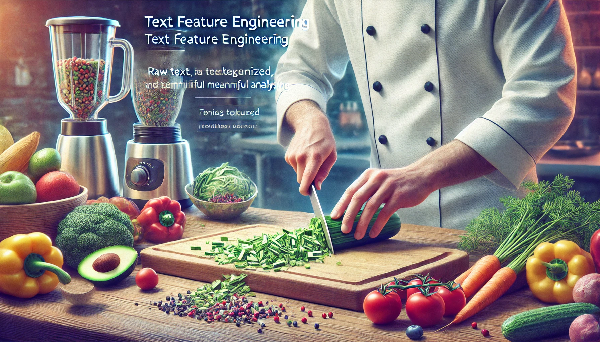

Text data is everywhere—customer reviews, support tickets, product descriptions, survey responses—and it’s often the **most underutilized source of insight** in a dataset. While numbers are easy to model, **text requires more creativity and structure** to be useful.

This article explores:\
✅ Why text is challenging—and powerful—for machine learning.\
✅ How to extract structured features from raw text.\
✅ Key techniques like **TF-IDF**, **text length**, **sentiment**, and **n-grams**.\
✅ Practical examples in **R (tidytext)** and **Python (scikit-learn / NLP)**.

# **Why Text Needs Feature Engineering**

Unlike numerical or categorical features, text data is:

-   **Unstructured** — There’s no inherent format, just characters.

-   **Variable in length** — A tweet and a product review are both “text” but vastly different.

-   **Rich in signal** — Word choice, tone, and structure carry valuable information.

### **So why don’t we just throw text into a model?**

Because most machine learning algorithms expect **fixed-length, structured inputs**. Text must be **transformed into features** the model can learn from.

### **📌 What Can We Learn from Raw Text?**

| Signal Type   | Example Feature                        |
|---------------|----------------------------------------|
| **Volume**    | Number of characters, words, sentences |
| **Structure** | Use of punctuation, capital letters    |
| **Semantics** | TF-IDF scores, word embeddings         |
| **Sentiment** | Polarity score, positive/negative tone |
| **Topic**     | Presence of key terms, topic clusters  |

These features can be numeric, binary, categorical, or even embedded vectors.

### **📌 Example Use Case: Hotel Review Sentiment**

| Review Text | Stars | Word Count | Sentiment | TF-IDF | ... |
|----|----|----|----|----|----|
| "The room was spotless and the staff was kind." | 5 | 9 | Positive | ... |  |
| "Terrible service and dirty bathroom." | 1 | 6 | Negative | ... |  |

✅ We can model review **stars**, **churn likelihood**, or **customer satisfaction** using engineered text features.

# **Basic Text Feature Extraction (Length, Count, Structure)**

Before jumping into complex techniques like embeddings or TF-IDF, let’s not overlook the **surprisingly powerful features** that come straight from the structure of the text itself. These **basic numeric summaries** often carry strong signals—especially in short-form content like reviews, tickets, or emails.

This chapter focuses on extracting structural and volume-based features such as:\
✅ **Character and word counts**\
✅ **Punctuation and special characters**\
✅ **Capitalization and formatting patterns**\
✅ **Readability metrics**

## **1️⃣ Text Length-Based Features**

The **length of text** can often correlate with its meaning or intent.

| Text                                           | Word Count | Char Count |
|------------------------------------------------|------------|------------|
| "OK."                                          | 1          | 3          |
| "Thanks so much for your help!"                | 6          | 31         |
| "Absolutely terrible experience, never again." | 6          | 44         |

### 📌 R: Length Features Using `stringr` and `dplyr`

``` r
library(dplyr)
library(stringr)

df <- df %>%
  mutate(
    word_count = str_count(text, "\\w+"),
    char_count = str_length(text)
  )
```

### 📌 Python: Length Features Using `pandas`

``` python
df['word_count'] = df['text'].str.split().str.len()
df['char_count'] = df['text'].str.len()
```

✅ These features often act as **proxies for verbosity, clarity, or emotional tone**.

## **2️⃣ Punctuation & Special Character Features**

Characters like **exclamation points**, **question marks**, **emojis**, or **ALL CAPS** often express **emotion, urgency, or attitude**.

| Text                | Excl. Count | Uppercase Count |
|---------------------|-------------|-----------------|
| "This is AMAZING!!" | 2           | 7               |
| "Is this working?"  | 0           | 0               |

### 📌 R: Punctuation Features Using `stringr`

``` r
df <- df %>%
  mutate(
    num_exclam = str_count(text, "!"),
    num_question = str_count(text, "\\?"),
    num_upper = str_count(text, "[A-Z]")
  )
```

### 📌 Python: Same in `pandas`

``` python
df['num_exclam'] = df['text'].str.count('!')
df['num_question'] = df['text'].str.count('\\?')
df['num_upper'] = df['text'].str.findall(r'[A-Z]').str.len()
```

## **3️⃣ Readability & Complexity Features**

Basic stats like **average word length**, **long word ratio**, or **Flesch reading ease** can provide insight into **how formal, technical, or accessible** the text is.

### 📌 Python Example: Readability with `textstat`

``` {.python .R}
import textstat

df['readability'] = df['text'].apply(textstat.flesch_reading_ease)
```

### 📌 R Example: Readability with `quanteda`

``` r
library(quanteda)

df$readability <- textstat_readability(df$text, measure = "Flesch")$Flesch
```

✅ **High or low readability** can signal anything from spam to legal language to customer distress.

## **📌 Summary: Structural Features to Start With**

| Feature                      | What It Reflects          |
|------------------------------|---------------------------|
| Word / Character Count       | Length, verbosity         |
| Number of Exclamation Points | Emotion, intensity        |
| Number of Uppercase Letters  | Emphasis, shouting        |
| Readability Score            | Complexity, accessibility |

These **simple metrics** are easy to compute and can deliver **strong baseline performance**, especially when used alongside other structured data.

# **Keyword-Based Features – TF-IDF, N-Grams & Frequency Counts**

Once you’ve squeezed all the value out of structural and length-based features, it’s time to go deeper—into the **words themselves**. Keyword-based features transform raw text into a **structured representation** of its content, allowing your models to **capture meaning, context, and emphasis**.

This chapter focuses on:\
✅ **Word and term frequency (TF)**\
✅ **TF-IDF (Term Frequency-Inverse Document Frequency)**\
✅ **N-grams (phrases of 2+ words)**\
✅ **Most frequent word indicators**

## **1️⃣ Term Frequency (TF) – Basic Bag-of-Words**

**Bag-of-Words (BoW)** is the foundation of keyword-based feature engineering. It counts **how many times each word appears** in a document, ignoring order and grammar.

| Text                   | love | this | product |
|------------------------|------|------|---------|
| "I love this product!" | 1    | 1    | 1       |
| "Product was great"    | 0    | 0    | 1       |

✅ Great for: **Simple models, short text like reviews or tweets.**\
❌ Ignores: **Context, synonyms, grammar, importance.**

### 📌 R: Bag-of-Words with `tidytext`

``` r
library(tidytext)
library(dplyr)

df_tokens <- df %>%
  unnest_tokens(word, text) %>%
  count(id, word) %>%
  bind_tf_idf(word, id, n)  # Optional step
```

### 📌 Python: Bag-of-Words with `CountVectorizer`

``` python
from sklearn.feature_extraction.text import CountVectorizer

vectorizer = CountVectorizer()
X_bow = vectorizer.fit_transform(df['text'])
```

## **2️⃣ TF-IDF – Emphasizing Unique Words**

**TF-IDF** downweights common words ("the", "is") and upweights words that are **rare but meaningful** in specific texts ("refund", "broken", "delighted").

$$TF-IDF(t,d) = TF(t,d) \times log(\frac{N}{DF(t)})$$

Where:

-   t = term

-   d = document

-   N = total number of docs

-   DF(t) = number of docs containing term t

### **📌 R: TF-IDF with `tidytext` (continued)**

Already done in the example above with `bind_tf_idf()`. You can then `cast_dtm()` to get the matrix.

### **📌 Python: TF-IDF with `TfidfVectorizer`**

``` python
from sklearn.feature_extraction.text import TfidfVectorizer

vectorizer = TfidfVectorizer()
X_tfidf = vectorizer.fit_transform(df['text'])
```

✅ Useful for: **Finding most distinguishing words across documents.**

## **3️⃣ N-Grams – Capturing Phrases, Not Just Words**

**N-grams** let you detect **phrases** like “credit card”, “bad service”, or “very helpful”. They reveal more **context** than isolated words.

| Text               | 2-grams                   |
|--------------------|---------------------------|
| "very bad service" | "very bad", "bad service" |

### **📌 R: Extracting Bigrams with `unnest_tokens()`**

``` r
df_bigrams <- df %>%
  unnest_tokens(bigram, text, token = "ngrams", n = 2)
```

### 📌 Python: Bigrams with `CountVectorizer`

``` python
vectorizer = CountVectorizer(ngram_range=(2, 2))
X_bigrams = vectorizer.fit_transform(df['text'])
```

✅ Powerful for: **Sentiment, intent detection, topic modeling.**

## **4️⃣ Flagging Important Terms (Keyword Indicators)**

Sometimes, all you need is a **binary indicator**: did the user mention “refund”? “cancel”? “perfect”? This is especially useful when domain-specific keywords drive decisions.

### 📌 R: Keyword Flags

``` r
df <- df %>%
  mutate(refund_mentioned = str_detect(text, regex("refund", ignore_case = TRUE)))
```

### 📌 Python: Keyword Flags

``` python
df['refund_mentioned'] = df['text'].str.contains('refund', case=False, na=False)
```

✅ This is a great lightweight feature in domain-specific tasks.

## **📌 Summary: Keyword-Based Feature Toolkit**

| Feature               | Use Case                              |
|-----------------------|---------------------------------------|
| **Bag-of-Words (TF)** | Basic presence of terms               |
| **TF-IDF**            | Detects unique terms in each document |
| **N-Grams**           | Captures meaningful phrases           |
| **Keyword Flags**     | Quick domain-specific signals         |

These features **bridge the gap between raw text and machine-readable inputs**, especially when building traditional ML models (e.g., logistic regression, random forest, XGBoost).

# **Semantic Features & Word Embeddings**

While keyword-based features like TF-IDF and n-grams are great at **counting words**, they fall short when it comes to understanding **meaning**. They treat "good" and "great" as unrelated, and "not bad" as equivalent to "bad."

That’s where **word embeddings** come in.

This chapter covers:\
✅ The concept behind word embeddings\
✅ Pretrained embeddings like **GloVe**, **Word2Vec**, and **FastText**\
✅ Sentence and document embeddings (e.g., **BERT**, **Doc2Vec**)\
✅ How to incorporate embeddings into machine learning workflows

## **1️⃣ What Are Word Embeddings?**

Embeddings represent words as **dense numeric vectors** in a way that captures **semantic similarity**. Words that occur in similar contexts will have **similar vectors**.

| Word     | Vector (simplified)        |
|----------|----------------------------|
| "cat"    | \[0.25, 0.81, -0.12, ...\] |
| "dog"    | \[0.27, 0.78, -0.09, ...\] |
| "coffee" | \[-0.45, 0.14, 0.66, ...\] |

🔹 "cat" and "dog" will have vectors closer to each other than to "coffee."\
🔹 Unlike BoW/TF-IDF, embeddings **preserve context and meaning**.

## **2️⃣ Using Pretrained Embeddings**

You can use pretrained embeddings (trained on massive corpora like Wikipedia or Common Crawl) instead of training your own.

### 📌 Python: Using GloVe or Word2Vec with `gensim`

``` python
import gensim.downloader as api

model = api.load("glove-wiki-gigaword-50")  # or "word2vec-google-news-300"
vector = model['coffee']  # 50-dimensional vector
```

To get a sentence or document embedding, average word vectors:

``` python
import numpy as np

def sentence_embedding(text):
    words = text.split()
    vectors = [model[word] for word in words if word in model]
    return np.mean(vectors, axis=0)

df['text_embedding'] = df['text'].apply(sentence_embedding)
```

### 📌 R: Using Pretrained Embeddings via `text2vec` or `text` packages

``` r
library(text)
# Create word embeddings (GloVe-like) using built-in embeddings
embeddings <- textEmbed("coffee is great")
```

✅ **R users can also use pretrained word embeddings from fastText via `text2vec` or spaCy (Python + reticulate).**

## **3️⃣ Contextual Embeddings (BERT and Friends)**

Unlike static embeddings, **transformer-based models** like **BERT** generate **context-aware embeddings**.

-   bank” in “river bank” ≠ “bank” in “savings bank”

-   BERT knows the difference based on sentence context.

### **📌 Python: Sentence Embeddings with `sentence-transformers`**

``` python
from sentence_transformers import SentenceTransformer

model = SentenceTransformer('all-MiniLM-L6-v2')
df['embedding'] = df['text'].apply(lambda x: model.encode(x))
```

✅ Great for: **Semantic search, clustering, document similarity, advanced NLP tasks**\

❌ Slower and heavier than traditional models—but much more powerful.

## **4️⃣ When to Use Which?**

| Technique | Use Case | Pros | Cons |
|----|----|----|----|
| **TF-IDF** | Classical models | Simple, fast | Ignores meaning |
| **GloVe / Word2Vec** | General semantic similarity | Lightweight | No context awareness |
| **BERT / Transformers** | Deep NLP tasks, similarity, classification | Context-aware | Heavier, slower |

✅ Use embeddings when your task involves **meaning**, not just **frequency**.

## **📌 Summary: From Words to Meaningful Vectors**

| Feature Type | Example Use | Tool |
|----|----|----|
| Word Embedding | Semantic similarity | Word2Vec, GloVe, FastText |
| Sentence Embedding | Text classification, search | BERT, Sentence-BERT |
| Averaged Word Vectors | Quick sentence-level embedding | Manual or gensim |

Embeddings allow you to turn **freeform language into model-ready features** that capture relationships, tone, and intent.

# **Pitfalls & Best Practices for Text Features**

Working with text features can unlock massive value—but only if done carefully. Many common mistakes lead to **data leakage**, **overfitting**, or simply **ineffective feature usage**.

In this final chapter, we’ll cover:\
✅ Common pitfalls in text preprocessing\
✅ How to prevent leakage with TF-IDF and embeddings\
✅ Best practices for combining text with structured data\
✅ Model-friendly tips for production-ready pipelines

## **1️⃣ Common Pitfalls in Text Feature Engineering**

| Pitfall | Why It’s a Problem |
|----|----|
| 🔁 Preprocessing after splitting | Can cause leakage if you compute TF-IDF or vocab across full data |
| 🧼 Over-cleaning | Removing punctuation, stop words, or case can strip away meaning |
| 🔤 Rare word explosion | TF-IDF can explode in size if not pruned |
| 🧩 Treating text as fully independent | Ignoring interactions with structured data misses context |

### 📌 Example: Leakage via TF-IDF on Full Dataset

``` python
# ❌ Wrong: Vocabulary is learned from full dataset (train + test)
vectorizer = TfidfVectorizer()
X = vectorizer.fit_transform(df['text'])  # Leakage!

# ✅ Right: Fit only on training set
vectorizer.fit(df_train['text'])
X_train = vectorizer.transform(df_train['text'])
X_test = vectorizer.transform(df_test['text'])
```

✅ Always split your data first, then fit any vectorizers, embeddings, or scalers **only on the training set**.

## **2️⃣ Best Practices for Combining Text with Structured Data**

Text is rarely alone—you often want to **blend it with numeric or categorical data**. To make this work:

### ✔ Use column transformers or recipes to **handle each data type separately**

-   Scale numeric features

-   Encode categoricals (dummy or target encoding)

-   Transform text (TF-IDF, embeddings)

### ✔ Normalize or rescale after combining if needed

-   Especially important if you're using distance-based models (SVMs, KNN)

### **📌 Python: Combining Text with Structured Data Using `ColumnTransformer`**

``` python
from sklearn.compose import ColumnTransformer
from sklearn.preprocessing import StandardScaler, OneHotEncoder
from sklearn.feature_extraction.text import TfidfVectorizer

preprocessor = ColumnTransformer(transformers=[
    ('num', StandardScaler(), ['price', 'rating']),
    ('cat', OneHotEncoder(handle_unknown='ignore'), ['category']),
    ('txt', TfidfVectorizer(), 'review')
])
```

### 📌 R: Using `recipes` to Combine Text and Tabular Data

``` r
library(tidymodels)

recipe_combined <- recipe(target ~ ., data = df) %>%
  step_tokenize(review) %>%
  step_tf(review) %>%
  step_dummy(all_nominal_predictors()) %>%
  step_normalize(all_numeric_predictors())
```

✅ Combine text with other features in a **clean and modular** way that supports deployment.

## **3️⃣ Avoid Overfitting with Sparse Text Features**

TF-IDF and n-gram matrices often create **very high-dimensional, sparse datasets**. This can lead to overfitting, especially on small datasets.

### 🛠 Mitigation strategies:

-   Limit vocabulary size (`max_features` or `min_df`/`max_df`)

-   Use dimensionality reduction (e.g., Truncated SVD on TF-IDF)

-   Try embeddings instead, especially for deeper models

## **4️⃣ Choose Features Based on the Model Type**

| Model Type        | Preferred Text Features                    |
|-------------------|--------------------------------------------|
| Linear Models     | TF-IDF, n-grams                            |
| Tree-based Models | Aggregated embeddings, keyword flags       |
| Neural Networks   | Word or sentence embeddings                |
| Ensemble Models   | Combine structural, TF-IDF, and text flags |

✅ Not all models benefit from raw TF-IDF or embeddings—**choose based on interpretability and performance** needs.

## **📌 Summary: Text Feature Engineering Done Right**

| ✅ Best Practices | ❌ Pitfalls to Avoid |
|----|----|
| Preprocess after splitting | Preprocessing before split causes leakage |
| Use multiple feature types | Relying only on TF-IDF or BoW |
| Combine text with structured data | Ignoring interactions across features |
| Limit dimensionality of sparse features | Feeding 10k sparse terms into a random forest |

Text offers **rich signals**, but it must be handled carefully, especially when **integrating into broader modeling pipelines**.

# **Conclusion & What’s Next**

Text data is often seen as messy and complex—but with the right tools and techniques, it becomes one of the **most powerful sources of predictive insight** in your entire dataset.

Throughout this article, we’ve explored **how to turn raw text into structured, meaningful features**, ready to drive performance in your models.

## **✅ Key Takeaways from Text Feature Engineering**

✔ Even basic features like **word count, punctuation, and readability** can be surprisingly effective.\
✔ **TF-IDF and n-grams** help capture content, frequency, and intent across many documents.\
✔ **Word embeddings** (GloVe, Word2Vec) add **semantic understanding**, and transformer models like BERT allow **context-aware** representations.\
✔ **Avoid data leakage**—always split your data first, and fit vectorizers/embeddings only on the training set.\
✔ Combine text with structured features in **clean, modular pipelines** using `recipes` (R) or `ColumnTransformer` (Python).\
✔ Match your feature type to the model you’re using—and be wary of high dimensionality.

✅ **Good text features are not only useful in NLP tasks**—they can also **supercharge churn models, sentiment prediction, fraud detection, and more.**

## **📌 What’s Next in the Series?**

Up next is the **final article in the Feature Engineering Series**:

> **"The Final Cut – Choosing the Right Features for the Job"**

We’ll cover:\
🔹 **How to evaluate feature usefulness (correlation, importance, permutation)**\
🔹 **Feature selection strategies (filter, wrapper, embedded)**\
🔹 **When fewer features beat more**\
🔹 **Interpreting model feedback to refine your inputs**\
🔹 **Best practices for pruning, testing, and simplifying your feature space**

📦 Whether your features come from text, time-series, categories, or numbers—**this final episode will help you pick the best ones and ditch the rest.**
