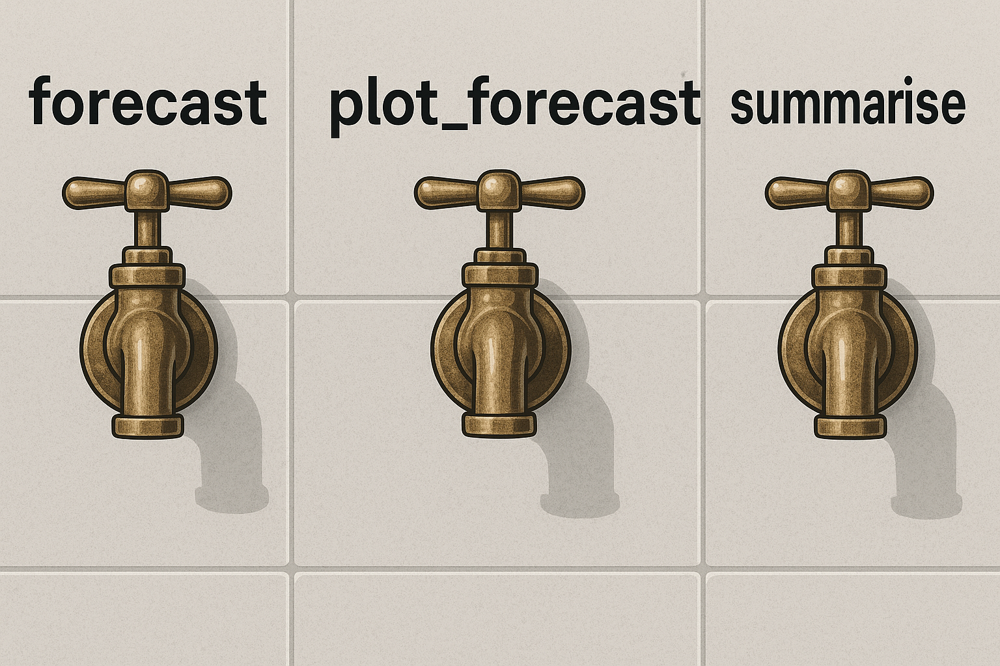

## 💧 Introduction

Imagine if your data could flow like water — available when needed, filtered to your taste, and ready to serve. As R users, we often write powerful analyses that live inside scripts or notebooks, waiting to be rerun or reknit. But what if someone else — a dashboard, a spreadsheet, even a non-technical colleague — could *turn a faucet* and get just the data or insight they need, right when they need it?

Enter [`plumber`](https://www.rplumber.io/): the package that transforms your R code into web-accessible endpoints. With just a few annotations, you can create lightweight, on-demand services — faucets — that deliver filtered data, summaries, forecasts, and even dynamic plots.

In this tutorial, we’ll build a trio of “data faucets” using the classic `gapminder` dataset. Each one will be activated via a simple HTTP GET request, controlled through query parameters — just like adjusting the knobs on a sink. No dashboards, no shiny, no server frameworks. Just clean, functional API plumbing in R.

## 🔧 What is plumber (and what is a data faucet)?

`plumber` is an R package that exposes R functions as web API endpoints. That means you can call your R code over HTTP — from a browser, a spreadsheet, or another app — and get results back as JSON.

In this metaphor, we’ll treat your code like a **faucet**. A faucet doesn’t boil water or change its chemistry — it just controls when, where, and how water flows. Similarly, a plumber endpoint gives users access to a very specific piece of logic you’ve defined in R: filter this data, summarize that column, draw a plot. They don’t need to understand the pipework underneath — just turn the handle.

A typical plumber endpoint looks like this:

```{r}
#| eval: false
#| include: true
#| echo: true
#| collapse: false


#* @get /hello
function(name = "World") {
  list(message = paste("Hello,", name))
}
```

Visiting `http://localhost:8000/hello?name=Alice` would return:

``` json
{
  "message": "Hello, Alice"
}
```

In the rest of this article, we’ll build more sophisticated faucets — not to say hello, but to **summarize**, **forecast**, and **visualize** data from `gapminder`.

## 🌍 Our dataset — a classic reservoir

Before you can open the tap, you need a water supply. In our case, that’s the `gapminder` dataset — a tidy, time-series snapshot of global development indicators. It’s compact, well-structured, and ideal for building API examples without external dependencies.

Let’s load the dataset and take a quick look:

```{r}
#| eval: false
#| include: true

library(gapminder)
library(dplyr)

data <- gapminder::gapminder
glimpse(data)

```

You’ll see six columns:

-   `country`: Name of the country

-   `continent`: Continent the country belongs to

-   `year`: Observation year (1952–2007 in 5-year steps)

-   `lifeExp`: Life expectancy

-   `pop`: Population

-   `gdpPercap`: GDP per capita

Think of this dataset as a **water tank** — structured, pressurized, and ready to be tapped. Every API call we’ll build will draw from this tank, apply some filtering or transformation, and return a clean stream of results.

Here’s a simple example using `dplyr` to filter the data manually — we’ll soon automate this behind an endpoint:

```{r}
#| eval: false
#| include: true

data %>%
  filter(country == "Poland", year >= 1972, year <= 2002) %>%
  select(year, lifeExp)
```

This snippet answers a narrow question: *How has life expectancy changed in Poland between 1972 and 2002?*\

Now let’s build a faucet that does this — on demand.

## Faucet 1 — Data summary on request

Our first faucet delivers **summary statistics** for any country and development metric in the dataset. Think of it as a cold-water tap: you specify the country and the metric, and it returns a quick, refreshing snapshot — no modeling, no visualization, just facts.

💡 Example request:

```         
GET /summary?country=Poland&metric=lifeExp
```

Expected response:

```         
{
  "country": "Poland",
  "metric": "lifeExp",
  "min": 61.0,
  "max": 75.5,
  "mean": 70.34,
  "median": 71.0,
  "latest": 75.5
}
```

## 🧠 Behind the faucet: the R function

Let’s write an R function that accepts a country and a metric, filters the dataset accordingly, and returns a named list of basic statistics:

```{r}
#| eval: false
#| include: true

summary_stats <- function(data, country, metric) {
  if (!(metric %in% names(data))) {
    stop("Metric not found in dataset")
  }

  df <- data %>% 
    filter(country == !!country) %>%
    select(year, value = all_of(metric)) %>%
    arrange(year)

  if (nrow(df) == 0) {
    stop("No data found for selected country")
  }

  list(
    country = country,
    metric = metric,
    min = min(df$value, na.rm = TRUE),
    max = max(df$value, na.rm = TRUE),
    mean = mean(df$value, na.rm = TRUE),
    median = median(df$value, na.rm = TRUE),
    latest = tail(df$value, 1)
  )
}

```

## 🔌 Exposing the faucet with plumber

Now we add this function to a plumber route. Here’s how to define a `/summary` endpoint that accepts query parameters for `country` and `metric`:

```{r}
#| eval: false
#| include: true

# plumber.R
#* @param country The name of the country (e.g. "Poland")
#* @param metric The metric to summarize (e.g. "lifeExp", "gdpPercap")
#* @get /summary
function(country = "", metric = "lifeExp") {
  tryCatch({
    summary_stats(data, country, metric)
  }, error = function(e) {
    list(error = e$message)
  })
}

```

Save this file and launch the API with:

```{r}
#| eval: false
#| include: true
pr <- plumber::plumb("plumber.R")
pr$run(port = 8000)
```

Now try visiting:

```         
http://localhost:8000/summary?country=Poland&metric=lifeExp
```

💡 *Tip: if you get an error, check spelling — plumber doesn’t do autocomplete!*

You’ve now built your first live data faucet: users can request a country and a metric, and get real-time stats — no dashboards, no spreadsheets.

## 🔥 Faucet 2 — Forecasting future flow

Our next faucet doesn’t just report the past — it **predicts the future**. Given a country, a metric (like life expectancy), and a time range, it builds a **linear trend model** and forecasts future values for a specified horizon.

Think of this as a **hot water tap**: it uses energy (a model) to project where things are going — not just where they’ve been.

💡 Example request:

```         
GET /forecast?country=Poland&metric=lifeExp&from=1972&to=2002&horizon=10
```

Expected response (truncated):

```         
[
  { "year": 1972, "value": 70.1 },
  ...
  { "year": 2002, "value": 75.5 },
  { "year": 2007, "value": 76.4 },
  { "year": 2012, "value": 77.3 }
]
```

#### 🔧 Modeling the future with `lm()`

Let’s write a function that:

1.  Filters the dataset by country and year range

2.  Fits a linear regression model (`lm(value ~ year)`)

3.  Forecasts `horizon` years into the future (at 5-year intervals) 

```{r}
#| eval: false
#| include: true
forecast_lm <- function(data, country, metric, from, to, horizon = 10) {
  df <- data %>%
    filter(country == !!country, year >= from, year <= to) %>%
    select(year, value = all_of(metric)) %>%
    arrange(year)

  if (nrow(df) < 3) stop("Not enough data points to build a model")

  model <- lm(value ~ year, data = df)

  last_year <- max(df$year)
  future_years <- tibble(year = seq(last_year + 5, last_year + horizon, by = 5))
  preds <- predict(model, newdata = future_years)

  forecast <- bind_rows(
    df,
    tibble(year = future_years$year, value = preds)
  )

  forecast
}
```

🧩 Creating the `/forecast` endpoint

```{r}
#| eval: false
#| include: true

# plumber.R
#* @param country Country name
#* @param metric Metric to forecast
#* @param from Start year
#* @param to End year
#* @param horizon Years to forecast beyond `to`
#* @get /forecast
function(country = "", metric = "lifeExp", from = 1962, to = 2007, horizon = 10) {
  tryCatch({
    from <- as.numeric(from)
    to <- as.numeric(to)
    horizon <- as.numeric(horizon)

    result <- forecast_lm(data, country, metric, from, to, horizon)
    result
  }, error = function(e) {
    list(error = e$message)
  })
}

```

Start or reload your plumber API, then try:

```         
http://localhost:8000/forecast?country=Poland&metric=lifeExp&from=1972&to=2002&horizon=10
```

You now have a faucet that **models and delivers future insights** on the fly.

## 🖼️ Faucet 3 — Line chart with a twist

So far, your API can serve stats and forecasts — but sometimes numbers just don’t flow as well as **pictures**. This final faucet will return a **line chart** showing the historical and forecasted values as a single visual stream.

This is the *designer faucet* — it doesn’t just give you water, it does it with flair.

💡 Example request:

```         
GET /forecast?country=Poland&metric=lifeExp&from=1972&to=2002&horizon=10&plot=true
```

Expected response:

```         
{
  "plot": "data:image/png;base64,iVBORw0KGgoAAAANSUhEUgAA..."
}
```

This base64-encoded string can be rendered directly in an HTML `img` tag, embedded in dashboards, or downloaded as a PNG.

### 🖌 Generating the plot

We’ll use `ggplot2` to draw the chart and `base64enc` to encode the image for API delivery.

```{r}
#| eval: false
#| include: true
library(ggplot2)
library(base64enc)

plot_forecast <- function(df, country, metric) {
  p <- ggplot(df, aes(x = year, y = value)) +
    geom_line(color = "steelblue", size = 1) +
    geom_point(size = 2) +
    theme_minimal() +
    labs(
      title = paste("Forecast for", country),
      y = metric, x = "Year"
    )

  tf <- tempfile(fileext = ".png")
  ggsave(tf, plot = p, width = 6, height = 4, dpi = 150)
  dataURI(file = tf, mime = "image/png")
}
```

### 🧩 Updating the `/forecast` endpoint with `plot=TRUE`

Let’s update the existing endpoint to return either raw data or a plot, based on a `plot` parameter:

```{r}
#| eval: false
#| include: true
#* @serializer contentType list(type='image/png')
#* @get /forecast
function(country = "", metric = "lifeExp", from = 1962, to = 2007, horizon = 10, plot = "false") {
  tryCatch({
    from <- as.numeric(from)
    to <- as.numeric(to)
    horizon <- as.numeric(horizon)
    plot <- tolower(plot) == "true"

    result <- forecast_lm(data, country, metric, from, to, horizon)

    if (plot) {
      p <- ggplot(result, aes(x = year, y = value)) +
        geom_line(color = "steelblue", size = 1) +
        geom_point(size = 2) +
        theme_minimal() +
        labs(
          title = paste("Forecast for", country),
          y = metric, x = "Year"
        )

      tf <- tempfile(fileext = ".png")
      ggsave(tf, plot = p, width = 6, height = 4, dpi = 150)

      # Return file connection (plumber will serve it directly as image/png)
      readBin(tf, "raw", n = file.info(tf)$size)
    } else {
      result
    }
  }, error = function(e) {
    list(error = e$message)
  })
}

```

### 🧪 Test the PNG response

Visit this in your browser:

```         
http://localhost:8000/forecast?country=Poland&metric=lifeExp&from=1972&to=2002&horizon=10&plot=true
```

{width="524"}

## 🛠️ Putting it all together

At this point, you’ve built a small but mighty collection of **data faucets**:

-   `/summary` delivers quick statistics based on country and metric

-   `/forecast` returns a time-extended series — either as JSON or as a **real PNG** chart

-   You’ve used plumber to wire up these faucets into accessible, browser-friendly endpoints

Now let’s look at how to organize and run this whole system.

#### 🔧 Final `plumber.R` file (minimal, modular version)

```{r}
#| eval: false
#| include: true
library(plumber)
library(dplyr)
library(gapminder)
library(ggplot2)

data <- gapminder::gapminder

# Summary function
summary_stats <- function(data, country, metric) {
  if (!(metric %in% names(data))) stop("Metric not found")
  df <- data %>%
    filter(country == !!country) %>%
    select(year, value = all_of(metric)) %>%
    arrange(year)
  if (nrow(df) == 0) stop("No data found")

  list(
    country = country,
    metric = metric,
    min = min(df$value, na.rm = TRUE),
    max = max(df$value, na.rm = TRUE),
    mean = mean(df$value, na.rm = TRUE),
    median = median(df$value, na.rm = TRUE),
    latest = tail(df$value, 1)
  )
}

# Forecast function
forecast_lm <- function(data, country, metric, from, to, horizon) {
  df <- data %>%
    filter(country == !!country, year >= from, year <= to) %>%
    select(year, value = all_of(metric)) %>%
    arrange(year)
  if (nrow(df) < 3) stop("Not enough data")

  model <- lm(value ~ year, data = df)
  future_years <- tibble(year = seq(max(df$year) + 5, max(df$year) + horizon, by = 5))
  preds <- predict(model, newdata = future_years)

  bind_rows(df, tibble(year = future_years$year, value = preds))
}

#* @get /summary
function(country = "", metric = "lifeExp") {
  tryCatch({
    summary_stats(data, country, metric)
  }, error = function(e) list(error = e$message))
}

#* @serializer contentType list(type='image/png')
#* @get /forecast
function(country = "", metric = "lifeExp", from = 1962, to = 2007, horizon = 10, plot = "false") {
  tryCatch({
    from <- as.numeric(from)
    to <- as.numeric(to)
    horizon <- as.numeric(horizon)
    plot <- tolower(plot) == "true"

    result <- forecast_lm(data, country, metric, from, to, horizon)

    if (plot) {
      p <- ggplot(result, aes(x = year, y = value)) +
        geom_line(color = "steelblue", size = 1) +
        geom_point(size = 2) +
        theme_minimal() +
        labs(title = paste("Forecast for", country), y = metric, x = "Year")

      tf <- tempfile(fileext = ".png")
      ggsave(tf, plot = p, width = 6, height = 4, dpi = 150)
      readBin(tf, "raw", n = file.info(tf)$size)
    } else {
      result
    }
  }, error = function(e) list(error = e$message))
}

```

#### ▶️ Running the API

In a script or console:

```{r}
#| eval: false
#| include: true
pr <- plumber::plumb("plumber.R")
pr$run(port = 8000)
```

You now have a live REST API with:

-   `GET /summary?country=Sweden&metric=lifeExp`

-   `GET /forecast?country=Poland&from=1972&to=2002&horizon=10`

-   `GET /forecast?country=Poland&plot=true` → returns image

This can be accessed from:

-   **Web browsers**

-   **R, Python, JS clients**

-   **Excel or Power BI as a Web data source**

-   **Scheduled scripts or cron jobs**

## 🧩 Real-world use cases

Building an API in R isn’t just a neat exercise — it opens doors to automation, collaboration, and smarter data workflows. Here’s how you can put your new set of **data faucets** to work in the wild.

#### 💼 1. **Business dashboards (without Shiny)**

Have a team that needs to monitor key indicators — like GDP, life expectancy, or population trends — but doesn't need interactive Shiny apps?

-   Serve your forecasts or summaries as **JSON** to tools like **Power BI**, **Google Sheets**, or **Grafana**.

-   Point a GET request at your `/summary` or `/forecast` endpoint.

-   Bonus: use query parameters to adjust country, metric, or time range dynamically.

#### 📈 2. **Report automation with Quarto**

Want a PDF or HTML report that updates automatically every week?

-   In your Quarto document, call the API using `httr::GET()` or `jsonlite::fromJSON()`.

-   Pull in fresh forecasts or visuals just before knitting.

-   Schedule the report generation via cron, GitHub Actions, or RStudio Connect.

Example code block in R Markdown:

```{r}
#| eval: false
#| include: true
response <- jsonlite::fromJSON("http://localhost:8000/summary?country=Kenya&metric=lifeExp")
```

#### 🤝 3. **Cross-language collaboration**

Have Python developers or JavaScript apps that need data from your R analysis?

-   No need to share scripts or environments — just provide API access.

-   Python client example:

```{python}
#| eval: false
#| include: true
import requests
response = requests.get("http://localhost:8000/summary", params={"country": "Norway"})
print(response.json())

```

-   Works with any language that can make HTTP requests.

#### 📤 4. **Batch forecasting or scheduled predictions**

Want to auto-refresh 5-year projections for 100 countries?

-   Write an R script that loops through countries, hits `/forecast`, and saves the results.

-   Useful for building datasets, dashboards, or feeding a downstream model.

#### 🌍 5. **Public-facing endpoints**

If your data is safe to share, expose endpoints externally (e.g. via ShinyApps.io, Posit Connect, or a lightweight cloud server). You’ll have:

-   Educational tools for students and journalists

-   Interactive demos for workshops

-   Lightweight alternatives to heavy web apps

Just be sure to handle request limits, logging, and basic input validation.

Even without a frontend or database, your plumber API becomes a flexible, modular **backbone** for all kinds of data delivery — internal or external, on-demand or automated.

## 🧾 Conclusion: small faucets, big flow

You didn’t build a dashboard.\
You didn’t deploy a full app.\
And yet, with just a few lines of R and `plumber`, you created something powerful: **an accessible, reusable, on-demand interface to your data**.

By treating your analysis like plumbing — with controlled flow, modular design, and clean output — you’ve turned raw R scripts into **living services**. Whether it’s a quick summary, a forward-looking forecast, or a real-time chart, your data is now:

-   Self-serve

-   Language-agnostic

-   Reusable

-   Ready for production (or a very elegant hack)

And best of all: **you’re still just writing R**.

### 🛠 What’s next?

Here are a few ways you can evolve this system:

-   🧮 **Swap in more powerful models**: Try `prophet`, `ARIMA`, or `fable` instead of `lm()`

-   🌍 **Add geo endpoints**: Return top countries by growth or metrics per continent

-   📦 **Connect to real data**: Read from a live database or API instead of `gapminder`

-   🧪 **Add tests**: Use `testthat` to validate endpoints and logic

-   🚀 **Deploy it**: Host it via Docker, Posit Connect, or a simple VPS with `systemd`

The key takeaway?\
**APIs don’t need to be heavy, complex, or coupled to ML.**\
Sometimes, a clean faucet with exactly the data you want is more than enough.

### Related Reading

If you want to continue with a closely related topic:

-   [The Final Cut – Choosing the Right Features for the Job](2025-04-29_Feature_engineering_part6.qmd)
-   [The Hidden Missing: What Your Data Isn’t Telling You](2025-06-09_The_Hidden_Missing.qmd)
