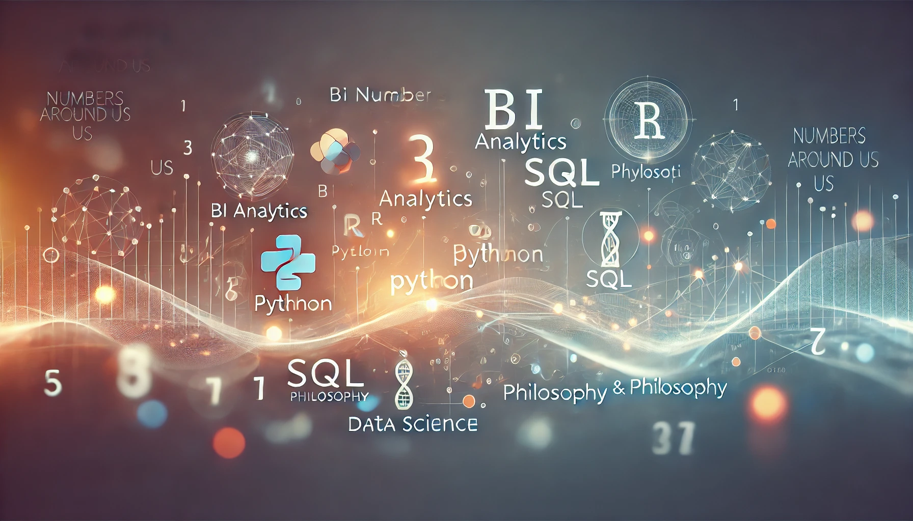

::: {.nau-hero}
::: {.nau-hero-copy}

Practical data writing

<h1>Numbers Around Us</h1>

A technical blog about analytics programming, business intelligence, data engineering, and the quieter structures that make data work trustworthy.

  <a class="nau-button primary" href="last-articles.html">Read newest articles</a>
  <a class="nau-button secondary" href="ds/index.html">Explore Data Science</a>

:::

::: {.nau-hero-media}

:::
:::

::: {.nau-section}
## What This Site Is About

Numbers Around Us is for people who work close to data: analysts, BI developers, data engineers, R and SQL users, dashboard builders, and anyone trying to make numbers mean something reliable.

::: {.nau-card-grid}
::: {.nau-card}
### Analytics Programming

Readable work with R, SQL, Python, Quarto, and the everyday techniques that turn messy input into useful analytical shape.
:::

::: {.nau-card}
### Business Intelligence

Dashboards, reports, chart design, interaction patterns, and the practical craft of turning metrics into decisions.
:::

::: {.nau-card}
### Data Philosophy

Reflections on trust, semantics, data quality, meaning, tooling, and the hidden assumptions that shape analytical work.
:::
:::
:::

::: {.nau-section}
## A Practitioner Point of View

::: {.nau-band}
The site is not built around tool hype. Tools matter, but the stronger questions are usually structural: what does this number mean, who trusts it, what decision does it support, and what breaks quietly when the assumptions are wrong?
:::

Explore the latest posts, browse the topic sections, or use the challenge solutions as practical exercises in analytical problem solving.
:::
