# Data Pipeline Patterns and Antipatterns

This document is a working catalog of common data pipeline design patterns and frequent antipatterns.

Use it as:

- a reference when designing new pipelines,
- a checklist during refactors,
- a source for future blog posts or article series.

## How to Read This Document

Each pattern contains:

- a short definition,
- when it is useful,
- the main tradeoff,
- a small Mermaid diagram.

Each antipattern contains:

- what it looks like,
- why it causes problems,
- how to replace it.

## Pattern Categories

1. Ingestion and landing
2. Validation and trust
3. State and reprocessing
4. Storage and historical modeling
5. Orchestration and execution
6. Observability and governance

---

## 1. Staging Pattern

Raw data first lands in a staging area before any business transformation starts. This isolates ingestion from downstream logic and preserves the original payload for debugging and reprocessing.

Best used when source systems are unstable, contracts are weak, or replay is important.

Main tradeoff: extra storage and one more layer to manage.

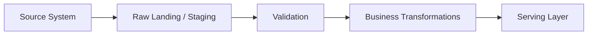

---

## 2. Split, Validate, Publish Pattern

The pipeline is explicitly separated into three phases: ingest data, validate it, then publish only trusted results. This reduces the risk of mixing technical extraction with business acceptance.

Best used when quality gates matter and consumers should only see approved data.

Main tradeoff: more orchestration steps.

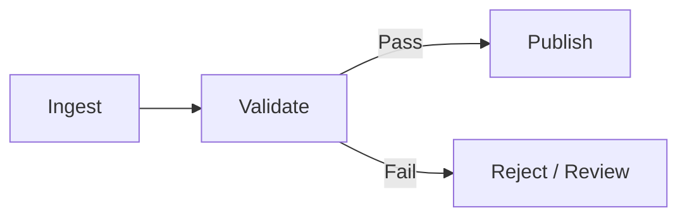

---

## 3. Idempotent Pipeline Pattern

Running the same job multiple times produces the same final state. This is critical for retries, backfills, and recovery after partial failure.

Best used in any production pipeline that may rerun.

Main tradeoff: requires careful keying, merge logic, and state handling.

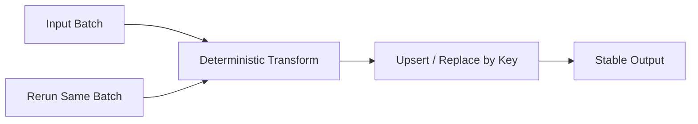

---

## 4. Bronze / Silver / Gold Pattern

Data flows through quality layers: raw ingestion, cleaned conformed data, then business-ready outputs. This is a common way to separate technical and semantic maturity.

Best used for lakehouse-style environments and shared analytics platforms.

Main tradeoff: teams often adopt the labels without clear entry/exit rules.

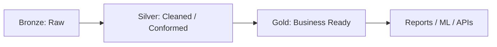

---

## 5. Contract-First Pipeline Pattern

The pipeline is designed from the expected output and consumer contract backward to the source. Schema, semantics, freshness, and ownership are explicit before implementation expands.

Best used when many teams depend on the same dataset.

Main tradeoff: more upfront design work.

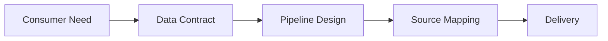

---

## 6. Schema Enforcement Pattern

Incoming data is validated against an expected structural contract: columns, types, nullability, naming, and formats. Structural failures are caught before business logic runs.

Best used at system boundaries.

Main tradeoff: strict checks can reject partially useful data.

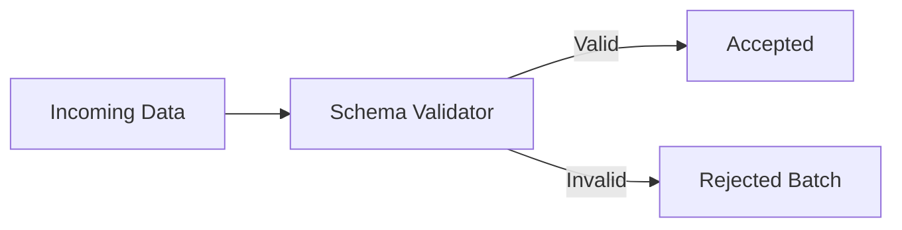

---

## 7. Semantic Checkpoint Pattern

The pipeline checks business meaning, not only structure. Examples include allowed states, metric consistency, domain thresholds, or logical relationships between fields.

Best used when silent semantic drift is more dangerous than technical failure.

Main tradeoff: requires domain knowledge and ongoing maintenance.

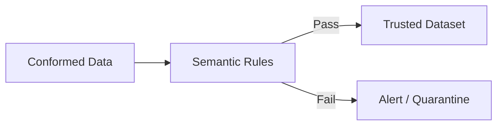

---

## 8. Reconciliation Pattern

The output of one stage is systematically compared with another system, stage, or aggregate expectation. This catches mismatches that normal validation may miss.

Best used in finance, regulated reporting, migration, and cross-system synchronization.

Main tradeoff: reconciliation rules can become noisy if tolerance is unclear.

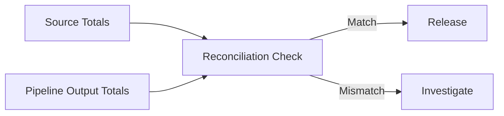

---

## 9. Quarantine Pattern

Bad or suspicious records are isolated without failing the entire pipeline. Good data keeps flowing while problematic rows are stored for review and remediation.

Best used when partial progress is better than total stoppage.

Main tradeoff: quarantined data can be ignored unless ownership is clear.

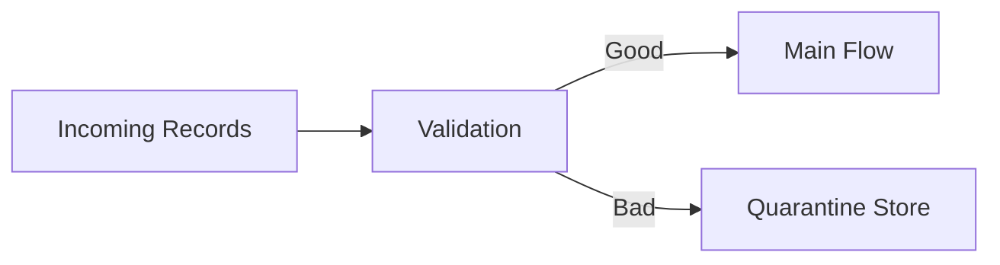

---

## 10. Dead-Letter Pattern

Messages or events that cannot be processed are moved to a dedicated dead-letter queue or store. This prevents infinite retries and creates an audit trail for failed processing.

Best used in event-driven and streaming systems.

Main tradeoff: dead-letter queues become data graveyards if nobody owns them.

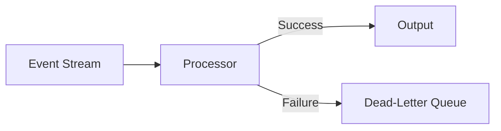

---

## 11. Retry with Backoff Pattern

Transient failures are retried with increasing delay. This reduces the impact of flaky networks, rate limits, and temporary unavailability.

Best used for external APIs and unstable integrations.

Main tradeoff: retries can hide systemic issues when they become the default success path.

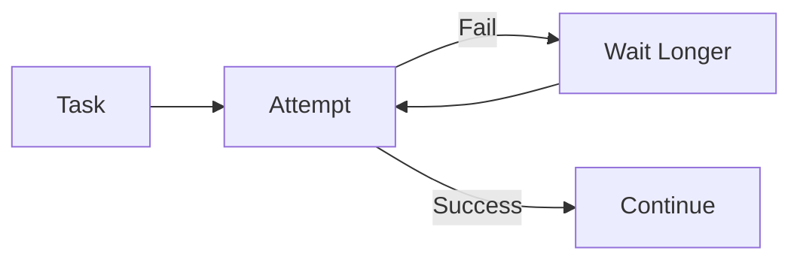

---

## 12. Checkpointing Pattern

The pipeline stores stable intermediate state so failed jobs can resume from a known point instead of recomputing everything.

Best used for long-running jobs and expensive transformations.

Main tradeoff: checkpoint management adds complexity and storage cost.

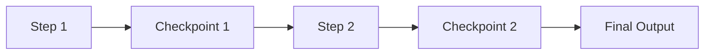

---

## 13. Incremental Load Pattern

Only new or changed data is processed. This improves efficiency and reduces time-to-delivery for large datasets.

Best used when source systems expose timestamps, watermarks, versions, or CDC.

Main tradeoff: incremental logic is easy to get subtly wrong.

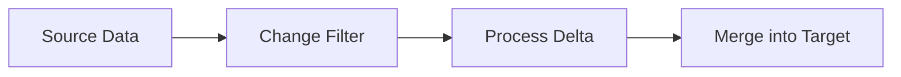

---

## 14. Full Refresh Pattern

The target dataset is rebuilt from scratch on each run. This is simple and reliable when volume is manageable.

Best used for small datasets, prototyping, or unstable transformation logic.

Main tradeoff: expensive for large data and less friendly to near-real-time use cases.

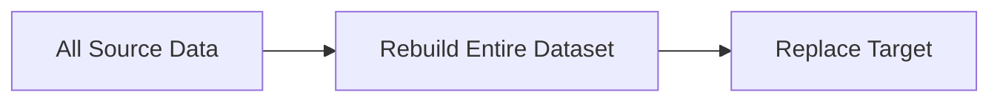

---

## 15. Change Data Capture Pattern

Instead of re-reading full tables, the pipeline reacts to inserts, updates, and deletes captured from source transaction logs or event streams.

Best used for low-latency replication and operational analytics.

Main tradeoff: CDC pipelines are operationally sensitive and require careful ordering.

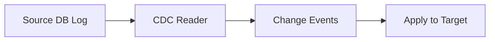

---

## 16. Append-Only Pattern

Data is never overwritten; new records or new versions are appended. This preserves history and simplifies auditability.

Best used for events, logs, immutable facts, and traceability-heavy systems.

Main tradeoff: consumers must know how to read current state from history.

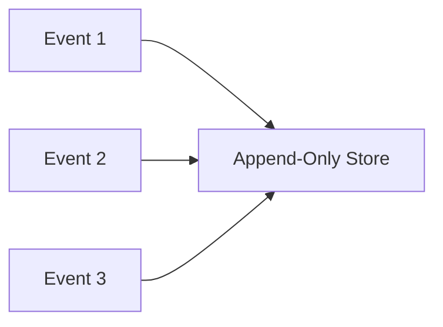

---

## 17. Snapshot Pattern

The system periodically stores a complete view of current state. This allows point-in-time comparison and historical analysis without replaying all events.

Best used for stateful entities such as inventory, customer status, and dimension state.

Main tradeoff: snapshots can become storage-heavy and coarse-grained.

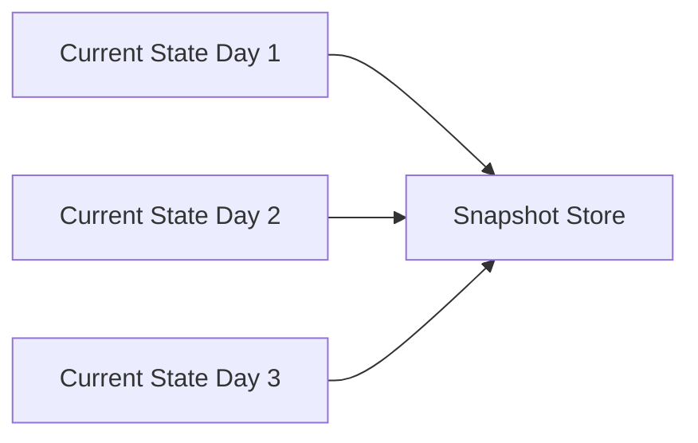

---

## 18. Slowly Changing Dimensions Pattern

Dimension attributes are tracked over time instead of simply overwritten. This preserves historical correctness for reporting.

Best used in dimensional models and historical business analysis.

Main tradeoff: more complex joins and model maintenance.

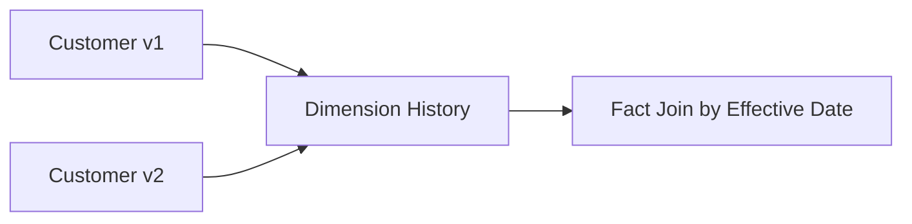

---

## 19. Fan-In Pattern

Multiple sources are standardized into one shared model or target. This is a convergence pattern used to create a single analytical view.

Best used for multi-source reporting and master datasets.

Main tradeoff: source-specific nuance can be lost in normalization.

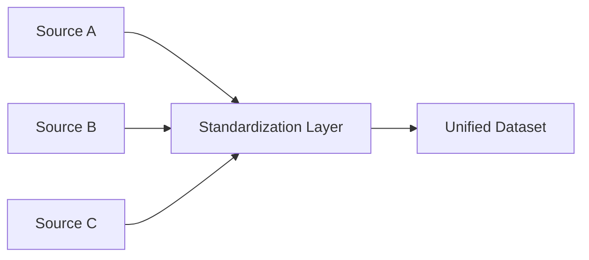

---

## 20. Fan-Out Pattern

One standardized dataset feeds multiple downstream consumers. This centralizes business logic and reduces duplication.

Best used when many outputs depend on the same trusted core.

Main tradeoff: a failure in the shared upstream affects many consumers at once.

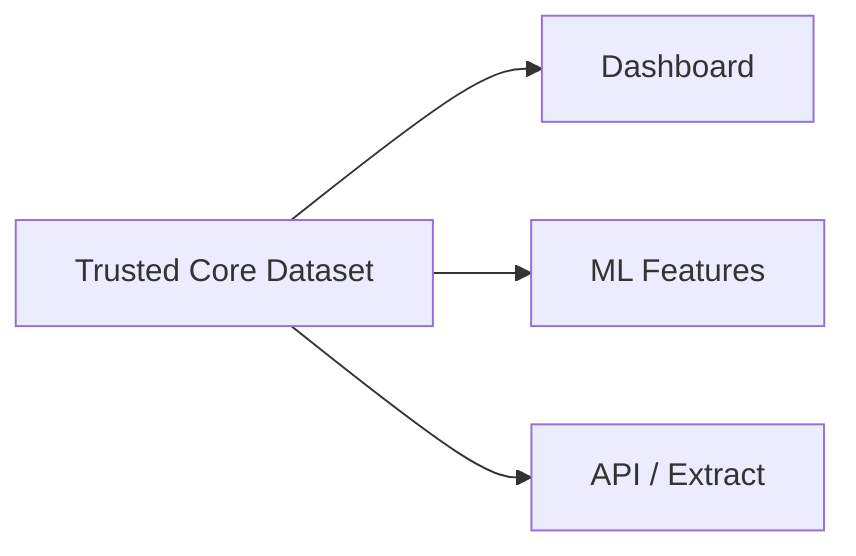

---

## 21. Pipeline as Small Steps Pattern

A large transformation is decomposed into small, stable, well-named steps. This improves testability, readability, and failure isolation.

Best used when a pipeline has grown into a monolith.

Main tradeoff: too many tiny steps can make navigation noisy.

```mermaid
flowchart LR
    A["Raw"] --> B["Normalize"]
    B --> C["Enrich"]
    C --> D["Aggregate"]
    D --> E["Serve"]
```

---

## 22. Orchestrated DAG Pattern

The pipeline is modeled as a directed acyclic graph with explicit dependencies, scheduling, and retries. Orchestration makes execution state visible and controlled.

Best used for complex multi-step batch systems.

Main tradeoff: orchestration tooling can dominate design decisions if overused.

```mermaid
flowchart TD
    A["Extract"] --> B["Stage"]
    B --> C["Validate"]
    C --> D["Transform"]
    D --> E["Publish"]
```

---

## 23. Event-Driven Pipeline Pattern

Pipeline execution starts when an event happens, not when a schedule ticks. This supports reactive architectures and lower latency.

Best used for operational systems and near-real-time propagation.

Main tradeoff: event ordering and observability are harder than in batch.

```mermaid
flowchart LR
    A["Business Event"] --> B["Event Bus"]
    B --> C["Pipeline Trigger"]
    C --> D["Processing"]
```

---

## 24. Batch Pattern

Data is collected and processed in time-based or volume-based batches. This is still the default pattern for many analytical systems.

Best used where latency requirements are measured in minutes or hours, not seconds.

Main tradeoff: freshness is bounded by schedule frequency.

```mermaid
flowchart LR
    A["Daily Data"] --> B["Scheduled Batch Job"]
    B --> C["Processed Batch"]
    C --> D["Analytics Output"]
```

---

## 25. Streaming Pattern

Data is processed continuously as it arrives. This supports fast reaction, rolling metrics, and event-based products.

Best used when delay materially reduces value.

Main tradeoff: correctness, ordering, and exactly-once guarantees are harder.

```mermaid
flowchart LR
    A["Continuous Events"] --> B["Stream Processor"]
    B --> C["Low-Latency Output"]
```

---

## 26. Lambda / Dual Path Pattern

The same domain is handled through both a fast path and a slower batch correction path. This combines responsiveness with later correctness and completeness.

Best used when real-time is needed but raw event processing is imperfect.

Main tradeoff: two paths mean two systems to reason about.

```mermaid
flowchart LR
    A["Incoming Data"] --> B["Speed Layer"]
    A --> C["Batch Layer"]
    B --> D["Combined Serving Layer"]
    C --> D
```

---

## 27. Data Observability Pattern

The pipeline exposes health through metrics on freshness, volume, quality, anomalies, latency, and lineage signals. Observability makes trust operational instead of anecdotal.

Best used for shared production platforms.

Main tradeoff: too many checks create alert fatigue.

```mermaid
flowchart LR
    A["Pipeline Run"] --> B["Metrics / Logs / Tests"]
    B --> C["Monitoring Layer"]
    C --> D["Alerts / Dashboards"]
```

---

## 28. Lineage Pattern

Every important dataset can be traced back to its inputs and transformations. Lineage supports debugging, governance, impact analysis, and trust.

Best used wherever metric changes affect many consumers.

Main tradeoff: lineage that is incomplete creates false confidence.

```mermaid
flowchart LR
    A["Source"] --> B["Stage"]
    B --> C["Transform"]
    C --> D["Metric Table"]
    D --> E["Dashboard"]
```

---

## 29. Versioned Data Pattern

Datasets, contracts, schemas, or transformations are versioned so changes are explicit and reversible. Consumers can adopt new versions intentionally.

Best used when breaking changes are likely or unavoidable.

Main tradeoff: multiple active versions increase maintenance cost.

```mermaid
flowchart LR
    A["Contract v1"] --> C["Consumer A"]
    B["Contract v2"] --> D["Consumer B"]
    E["Version Registry"] --> A
    E --> B
```

---

## 30. Self-Healing Pipeline Pattern

The pipeline can automatically recover from known failure modes, such as temporary outage, replayable lag, or schema-compatible retry. This reduces manual firefighting.

Best used after frequent known incidents are understood well.

Main tradeoff: automation can conceal fragility if it becomes a patch over bad design.

```mermaid
flowchart LR
    A["Failure Detected"] --> B["Recovery Logic"]
    B -->|Recovered| C["Resume Pipeline"]
    B -->|Not Recovered| D["Escalate to Human"]
```

---

# Data Pipeline Antipatterns

These are recurring failure shapes that make pipelines fragile, opaque, and expensive to trust.

---

## 1. Big Ball of DAG

One giant workflow does extraction, cleaning, business logic, reconciliation, and publishing in a single tangled graph.

Why it hurts:

- debugging is slow,
- ownership is unclear,
- any change has wide blast radius.

Preferred replacement: `Pipeline as Small Steps`, `Split, Validate, Publish`.

```mermaid
flowchart TD
    A["Extract"] --> B["Transform 1"]
    A --> C["Transform 2"]
    B --> D["Join"]
    C --> D
    D --> E["Fixes"]
    E --> F["Publish"]
    C --> G["Special Case"]
    G --> F
```

---

## 2. Validate at the End

The pipeline only checks data quality after all transformations are complete.

Why it hurts:

- bad data flows too far,
- root cause analysis becomes expensive,
- downstream systems may already consume damage.

Preferred replacement: `Schema Enforcement`, `Semantic Checkpoint`, `Quarantine`.

```mermaid
flowchart LR
    A["Raw Data"] --> B["Many Transforms"]
    B --> C["Late Validation"]
    C --> D["Too Late"]
```

---

## 3. Silent Coercion

Data types, formats, nulls, or invalid values are auto-converted without explicit policy.

Why it hurts:

- meaning changes without visibility,
- quality incidents look like valid data.

Preferred replacement: `Schema Enforcement`, explicit cast rules, reject-or-quarantine policy.

```mermaid
flowchart LR
    A["Messy Input"] --> B["Implicit Casts"]
    B --> C["Looks Valid"]
    C --> D["Wrong Semantics"]
```

---

## 4. Hidden Business Logic in SQL Fragments

Critical rules are scattered across ad hoc SQL, notebooks, BI tools, and manual exports.

Why it hurts:

- no single source of truth,
- rules drift across teams,
- impact analysis becomes guesswork.

Preferred replacement: centralized transformation layers, lineage, versioned logic.

```mermaid
flowchart LR
    A["Metric Logic"] --> B["SQL Script A"]
    A --> C["Notebook B"]
    A --> D["BI Calculation C"]
```

---

## 5. Spreadsheet Patch Layer

After the pipeline runs, someone manually “fixes” numbers in Excel or CSV before distribution.

Why it hurts:

- trust moves outside the platform,
- changes are undocumented,
- reproducibility disappears.

Preferred replacement: formal remediation flow, quarantine, versioned corrections.

```mermaid
flowchart LR
    A["Pipeline Output"] --> B["Manual Spreadsheet Fix"]
    B --> C["Shared Report"]
    C --> D["No Audit Trail"]
```

---

## 6. No Raw Preservation

The system transforms source data immediately and does not keep the original form.

Why it hurts:

- replay is hard,
- forensic debugging is weak,
- upstream disputes become impossible to verify.

Preferred replacement: `Staging Pattern`, append-only raw landing.

```mermaid
flowchart LR
    A["Source"] --> B["Immediate Transform"]
    B --> C["No Original Left"]
```

---

## 7. Retry Forever

Failed jobs or messages keep retrying indefinitely without escalation or cutoff.

Why it hurts:

- queues clog,
- duplicate effects appear,
- real incidents are delayed.

Preferred replacement: `Retry with Backoff`, `Dead-Letter`, escalation thresholds.

```mermaid
flowchart LR
    A["Fail"] --> B["Retry"]
    B --> A
```

---

## 8. Full Refresh by Habit

Every job rebuilds everything simply because it is easier than thinking through state.

Why it hurts:

- cost grows silently,
- latency remains high,
- scale problems arrive late and suddenly.

Preferred replacement: `Incremental Load`, `CDC`, selective refresh.

```mermaid
flowchart LR
    A["All Data"] --> B["Rebuild Everything"]
    B --> C["High Cost / Slow Delivery"]
```

---

## 9. Incremental Without Reconciliation

The pipeline only processes deltas but never checks whether the target still matches source truth.

Why it hurts:

- drift accumulates over time,
- missing or duplicated deltas stay invisible.

Preferred replacement: `Incremental Load` plus `Reconciliation` and periodic baseline checks.

```mermaid
flowchart LR
    A["Daily Delta"] --> B["Append / Merge"]
    B --> C["Target"]
    C --> D["Slow Drift"]
```

---

## 10. Orchestrator as Business Brain

Business rules are encoded directly inside orchestration tasks and dependency wiring.

Why it hurts:

- orchestration becomes unreadable,
- logic is tied to tooling,
- reuse is poor.

Preferred replacement: keep orchestration thin, push rules into tested transforms.

```mermaid
flowchart TD
    A["Scheduler"] --> B["If revenue then ..."]
    B --> C["Else special branch"]
    C --> D["More business logic"]
```

---

## 11. Gold Without Silver

Teams jump straight from raw data to business outputs with no shared conformed layer.

Why it hurts:

- duplicated cleaning logic,
- inconsistent metric definitions,
- fragile downstream reuse.

Preferred replacement: raw -> conformed -> serving structure.

```mermaid
flowchart LR
    A["Raw Data"] --> B["Dashboard Logic"]
    A --> C["ML Logic"]
    A --> D["Export Logic"]
```

---

## 12. One Metric, Many Definitions

The same business concept is computed differently across teams and tools.

Why it hurts:

- trust collapses,
- incidents turn political,
- reconciliation becomes social rather than technical.

Preferred replacement: `Contract-First`, semantic checkpoints, metric ownership.

```mermaid
flowchart LR
    A["Revenue"] --> B["Team A Definition"]
    A --> C["Team B Definition"]
    A --> D["Dashboard Definition"]
```

---

## 13. Monitoring Only Infrastructure

Teams watch CPU, runtime, and job success but not business validity, freshness, or data plausibility.

Why it hurts:

- the pipeline appears healthy while numbers are wrong.

Preferred replacement: `Data Observability`, semantic rules, reconciliation metrics.

```mermaid
flowchart LR
    A["Pipeline Green"] --> B["Infra OK"]
    B --> C["Business Wrong"]
```

---

## 14. Quarantine Without Ownership

Bad data is isolated, but nobody reviews, fixes, or closes the loop.

Why it hurts:

- quality debt accumulates quietly,
- the system normalizes partial failure.

Preferred replacement: clear ownership, SLA for quarantine review, feedback to producers.

```mermaid
flowchart LR
    A["Bad Records"] --> B["Quarantine"]
    B --> C["Ignored Forever"]
```

---

## 15. Schema Drift by Surprise

Sources change shape without notice and downstream learns only after failure or, worse, after silent misinterpretation.

Why it hurts:

- outages happen late,
- semantic damage can pass unnoticed.

Preferred replacement: schema contracts, versioning, early boundary checks.

```mermaid
flowchart LR
    A["Source Change"] --> B["No Contract"]
    B --> C["Downstream Breaks"]
```

---

## 16. Backfill as Panic Event

Historical reloads are rare, manual, risky, and undocumented.

Why it hurts:

- teams avoid corrections,
- past defects remain embedded,
- recovery is fear-driven instead of designed.

Preferred replacement: idempotency, checkpointing, replay-safe pipeline design.

```mermaid
flowchart LR
    A["Need Backfill"] --> B["Manual Emergency Process"]
    B --> C["High Risk"]
```

---

## 17. Append-Only Without Read Model

Everything is stored as history, but no curated view exists for consumers who need current truth.

Why it hurts:

- every user reinvents “latest state,”
- downstream inconsistency spreads.

Preferred replacement: append-only storage plus explicit current-state model or snapshots.

```mermaid
flowchart LR
    A["Historical Events"] --> B["Consumer A derives latest"]
    A --> C["Consumer B derives latest"]
    A --> D["Consumer C derives latest"]
```

---

## 18. Self-Healing Theater

The system auto-restarts and auto-retries often enough that teams mistake recurring fragility for resilience.

Why it hurts:

- root causes stay alive,
- reliability is performative, not structural.

Preferred replacement: use self-healing only for known transient failure classes and track recurrence.

```mermaid
flowchart LR
    A["Recurring Failure"] --> B["Auto Recover"]
    B --> C["Looks Fine"]
    C --> A
```

---

# Suggested Blog Series Cuts

If you want to turn this document into article series, the strongest cuts are:

## Series 1: Reliable Pipeline Foundations

- Staging Pattern
- Split, Validate, Publish
- Idempotent Pipeline
- Schema Enforcement
- Semantic Checkpoint

## Series 2: Stateful and Historical Design

- Incremental Load
- Full Refresh
- CDC
- Snapshot
- Slowly Changing Dimensions

## Series 3: Operational Trust

- Reconciliation
- Quarantine
- Dead-Letter
- Data Observability
- Lineage

## Series 4: What Goes Wrong

- Big Ball of DAG
- Spreadsheet Patch Layer
- Monitoring Only Infrastructure
- One Metric, Many Definitions
- Self-Healing Theater

---

# Final Note

The most useful shift is this:

Data pipelines should not be designed only to move data.

They should be designed to preserve meaning, enable replay, expose trust boundaries, and fail in ways that humans can understand.
